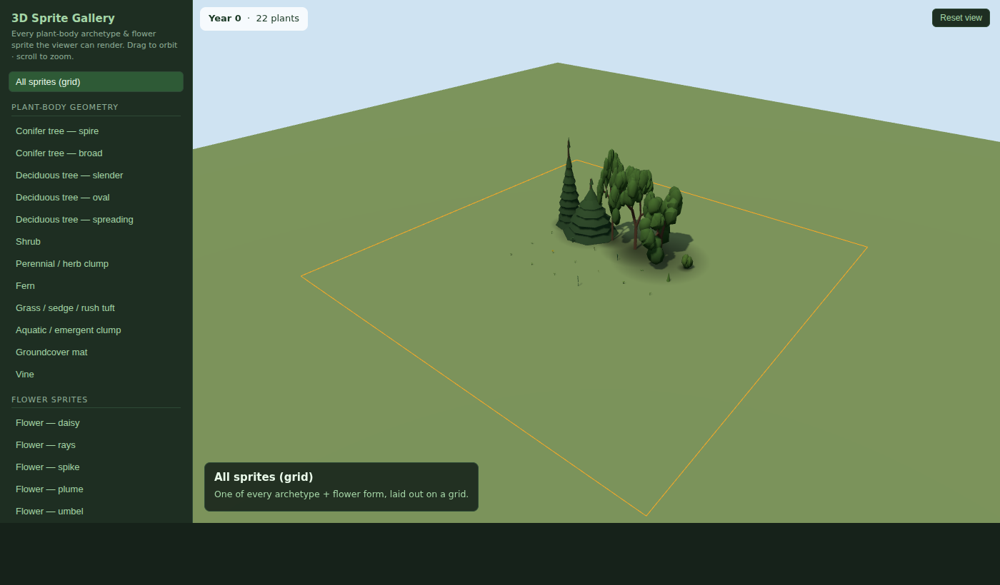
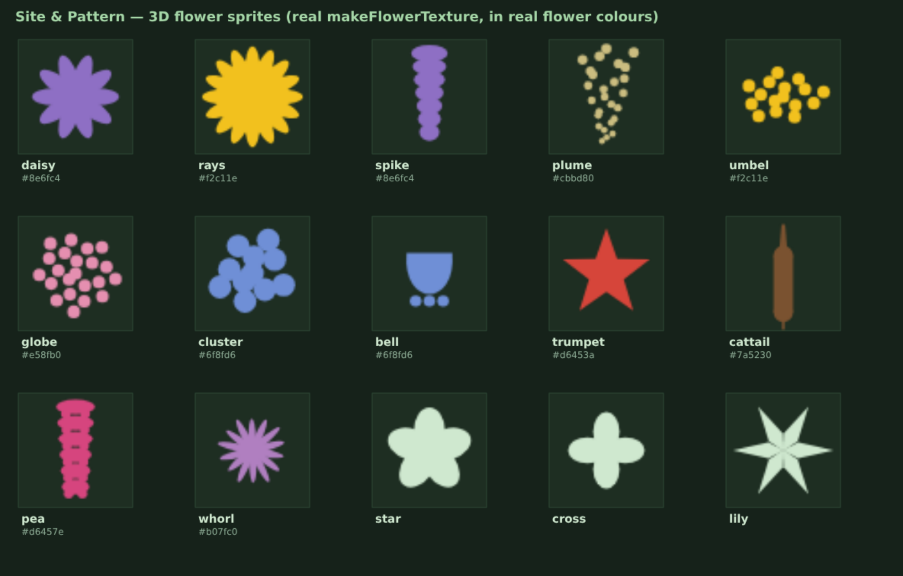

# 3D Sprites — reference & gallery

Every unique "sprite" the 3D viewer (`html/scene3d.html`) can render, in two
families: **plant-body geometry archetypes** (procedural meshes) and **flower
billboard sprites** (camera-facing textured points). This doc is the catalogue;
the **live gallery** below lets you rotate and inspect each one.

> **Since V2.27** the procedural plant/wildlife geometry documented here is the
> **built-in fallback set**: when Blender-generated GLB archetypes exist under
> `html/assets/models/`, the viewer renders those instead, per archetype, and
> falls back to these forms for anything missing. The GLB pipeline and its
> generator↔viewer contract live in [`3D_ASSETS.md`](3D_ASSETS.md). Flower and
> berry sprites below are unaffected — they layer on top of either geometry.

## See them live

**In the app:** **View → 3D Sprite Gallery…** — a native window that drives the
real viewer; pick any sprite from the sidebar, and set a **Detail** level
(Low / Medium / High) if the view is sluggish on your machine.

**Standalone (browser):** the same gallery as a web page — drag to orbit, scroll
to zoom, pick any item from the sidebar.

```bash
# from the repo root
python -m http.server 8000
# then open:
#   http://localhost:8000/html/sprite_gallery.html
```

Deep-link a single sprite with `?sprite=KEY`, e.g.
`…/sprite_gallery.html?sprite=conifer_pine` or `?sprite=shrub_dogwood`.



## Flower sprites

These are drawn by `makeFlowerTexture()` and rendered in each plant's real
`flower_color`, only while the scene month falls inside the plant's bloom window.
The image below is the **actual** `makeFlowerTexture` output (extracted from
`scene3d.html`), tinted with a representative real colour per form.

**Berries (V2.0):** fleshy-fruited plants (curated `fruit_color` — saskatoon,
chokecherry, currants, viburnum, dogwood, rose hips, blueberry…) show clusters of
shaded berries through the canopy during their `fruit_period` (`buildFruit`).
Dry-fruited plants (acorns, cones, catkins) carry no `fruit_color`, so they never
grow berries.



| Form | Looks like | Example plant (place to test) |
|------|-----------|-------------------------------|
| `daisy` | ringed petals + disc | Alpine Aster |
| `rays` | big composite sunflower | Balsamroot |
| `spike` | stacked tapering florets | Alberta Penstemon |
| `plume` | feathery tapering spray / seed-head | Alkali Cord Grass, goldenrod |
| `umbel` | flat-topped dot cluster | Golden Alexanders, Yarrow |
| `globe` | dense spherical head | Green Milkweed |
| `cluster` | rounded bunch of florets (default) | Alpine Forget-me-not |
| `bell` | hanging bell | Alaska Harebell |
| `trumpet` | 5-point tubular star | Blue Columbine |
| `cattail` | brown emergent spike *(V1.92)* | Cattail (Typha) |
| `pea` | legume raceme (banner + wings) *(V1.94)* | Silky Lupine, vetches, milkvetches |
| `whorl` | tubular whorl / shaggy head *(V1.94)* | Wild Bergamot (Monarda) |
| `star` | 5 broad rounded petals *(V2.1)* | Wild Blue Flax, geranium, phlox, prairie smoke |
| `cross` | 4 petals (mustard family) *(V2.1)* | Golden Draba |
| `lily` | 6 pointed tepals *(V2.1)* | Wood Lily, Blue-eyed Grass, camas, glacier lily |

## Plant-body geometry archetypes

Procedural meshes, bucketed by `plant_type` in `buildPlants()` → `byKind`.

**Species geometry (V1.94):** the most impactful keystone/host trees and shrubs
are differentiated by **genus** (from `scientific_name`) so they read as
themselves — see `TREE_PROFILES` / `_SPROF` in `scene3d.html`. Trees are still
built per crown form (slender / oval / spreading, forced per genus where it
matters) × maturity tier × per-individual sub-variation; a genus a profile
doesn't list falls back to the generic look.

| Archetype | Builder | Looks like | Place to test |
|-----------|---------|-----------|---------------|
| **Spruce** (Picea) | `buildConiferGeo` (spruce) | dense narrow bluish spire | White Spruce, Black Spruce |
| **Pine** (Pinus) | `buildPineGeo` | open, scraggly; clear trunk + tufted upper crown, yellow-green | Jack Pine, Lodgepole Pine |
| **Fir** (Abies/Pseudotsuga) | `buildConiferGeo` (fir) | narrow dark conic, sharp thin summit | Balsam Fir, Douglas Fir |
| **Larch / Tamarack** (Larix) | `buildConiferGeo` (larch) | soft sparse cone; deciduous needles (gold→bare) | Tamarack |
| **Aspen / Poplar** (Populus) | `generateDaVinciTree` | slender, pale bark, open round crown | Trembling Aspen, Balsam Poplar |
| **Birch** (Betula) | `generateDaVinciTree` | white bark, finer pendulous twigs | Paper Birch, Water Birch |
| **Oak** (Quercus) | `generateDaVinciTree` | broad gnarled spreading, dark | Bur Oak |
| **Willow** (Salix) | `generateDaVinciTree` | pale grey bark, weeping fringe | Bebb's Willow |
| Other tree | `generateDaVinciTree` | generic branch crown + foliage | cherry, apple, etc. |
| **Shrubs** (multi-stem clumps) | `buildShrubGeo` | a few ascending woody stems clothed with faceted low-poly leaf masses, silhouette by growth form *(V1.96)* | see below |

Shrubs are no longer a single dome — they're a multi-stem woody clump whose
**growth form** (`SHRUB_FORMS`) differs by genus, with crisp flat-shaded faceted
foliage masses:

| Form | Looks like | Genera |
|------|-----------|--------|
| `vase` | upright, clean base, fountain crown | Saskatoon, willow, hazelnut, alder, hawthorn, cherry |
| `spreading` | broad low clump (dogwood adds **red** stems) | Dogwood (Cornus), Viburnum |
| `mound` | low dense rounded thicket to the ground | Rose, spirea, snowberry, blueberry |
| `thicket` | many fine arching canes, airy | Currant (Ribes), raspberry |
| `irregular` | sparse asymmetric woody (often silvery) | Sagebrush, buffaloberry |
| **Herbaceous** (by growth form) | `buildPerennialGeo` | leaves built to the species' real habit *(V1.98)* | wildflower / herb / fern — see below |
| Grass / sedge / rush tuft | `buildGrassGeo` | dense fan of flat arching blades *(V1.92)* | a grass, sedge, or rush |
| Aquatic / emergent clump | `buildAquaticGeo` | tall erect strap leaves *(V1.92)* | an aquatic (Cattail, Great Bulrush) |
| Groundcover mat | `buildGroundcoverGeo` | low scatter of textured domes | Bearberry |
| Vine | `buildVineGeo` | sprawling/twining leafy stems *(V1.99)* | Blue Clematis, vetch, peavine |

Herbaceous plants (wildflower / herb / fern) are built to their **growth form**
(`HERB_FORMS`, keyed by genus via `_HPROF`, else inferred from flower form +
aspect) — leaves placed where the real plant carries them:

| Form | Looks like | Genera |
|------|-----------|--------|
| `erect` | tall leafy stem, lance leaves spiralling up | Fireweed, goldenrod, penstemon, blazingstar, lupine, paintbrush |
| `ferny` | low mound of fine feathery foliage + flat stalks | Yarrow, tansy, meadow rue, columbine, cinquefoil |
| `rosette` | basal leaf rosette under wiry flower stalks | Fleabane, arnica, evening primrose, avens, shooting star |
| `clump` | bushy upright leafy clump | Asters, sunflower, milkweed, bee balm |
| `grassy` | upright strap / linear basal leaves | Onion, harebell, blue-eyed grass, lily, camas |
| `mat` | low cushion of basal leaves | Pussytoes, umbrella-plant, violets, moss campion |
| `fern` | arching divided fronds | ferns |

Everything stays procedural + instanced + archetype-cached; genus changes
silhouette and colour, not per-frame cost. The **Detail** toggle scales build-time
density (blade / blob / leaf / tier counts) for weak hardware.

## Regenerating the gallery & images

The gallery scenes and the flower sheet are generated — re-run these if the
sprite set or seed data changes:

```bash
python scripts/make_gallery_scene.py      # → html/sprite_gallery_scenes.json
python scripts/render_flower_sprites.py   # → docs/3d/flower_sprites.png
```

`make_gallery_scene.py` builds each specimen scene through the real
`src.scene_contract.build_scene` (so every field matches the contract the viewer
reads); `render_flower_sprites.py` extracts the real `makeFlowerTexture` from
`scene3d.html` (no duplication) and renders it with headless Chromium.
