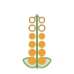
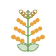
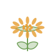
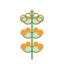
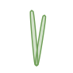
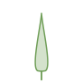
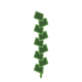
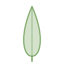
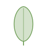

# Botany field guide — what to log while you read

*Design principle P5 — make the invisible visible. A word you cannot picture is
not a control; it is a coin flip with extra steps.*

This is the companion to the catalogue bench (`scripts/tune_morphology.py`).
It exists because the bench asks you to choose between *corymb* and *cyme*, or
*ovate* and *obovate*, and until V2.36 gave you no way to know which was which.

Everything drawn here is also **in the bench**: a small diagram beside each
dropdown, and the whole vocabulary one click away — where clicking the drawing
that matches your plant sets the value. This document is the version you can
read away from the screen with a flora open.

The drawings are generated from the botanical definitions by
`html/botany/diagrams.js` (`node scripts/render_botany_diagrams.js` rewrites
them). They are not traced from any published figure — see
[`DATA_SOURCES.md`](DATA_SOURCES.md) for why that distinction is kept carefully
in this project.

---

## Before you start: what actually changes the render

Not every character you can log changes what the app draws, and the ones that
do are not the ones you would guess. This is the honest map, traced through
`src/scene_contract.py` into `html/scene3d/`:

| Field | Reaches the sprite via | Effect |
|---|---|---|
| `growth_form` | `03-herbs.js` → `HERB_FORMS` | **Picks the plant's whole body.** The single highest-value field here. |
| `leaf_size_cm` + `mature_height_m` | `02-plants.js` → `grainClassFor` | Together pick one of three **leaf-grain classes** — it is the *ratio* of leaf length to plant height that matters, not either alone. |
| `leaf_shape` | `02-plants.js` → `bladeClassFor` | Picks one of four **blade classes** (see the caution below). |
| `mature_height_m` | everywhere | Scales the entire plant. |
| `leaf_arrangement` | `04-quality.js` | How leaves sit on the stem. |
| `leaf_surface` | `01b-surface.js` | Matte / glossy / hairy / waxy grain. |
| `branching` | `02-plants.js` | Woody silhouette — trees and shrubs only. |

**The caution.** `leaf_shape` has nineteen values but the renderer collapses
them into **four blade classes**:

- **narrow** — `linear`, `needle`, `awl`, `scale`, `lanceolate`
- **cut** — `lobed`, `pinnatifid`, `sagittate`
- **compound** — `trifoliate`, `compound_pinnate`, `compound_palmate`, `bipinnate`
- **broad** — everything else (`elliptic`, `ovate`, `obovate`, `orbicular`,
  `cordate`, `reniform`, `spatulate`)

So correcting `ovate` → `elliptic` changes **nothing** on screen; correcting
`ovate` → `lanceolate` changes the plant. Log the precise term anyway — it is
right, and the plant-identification lesson (F83) will want it — but if you are
optimising for visible improvement, spend your attention on the *class
boundaries*, and on `growth_form`, which has no such collapsing.

Where the catalogue stands today, across all 434 species:

| | |
|---|---|
| `leaf_shape`, `leaf_size_cm`, `leaf_arrangement`, `mature_height_m` | **0 blank** — every one is a genus-level *guess* |
| `growth_form` | 69 blank |
| `leaf_surface` | 352 blank |
| `branching` | 365 blank (woody species only) |
| Blade classes as seeded | narrow 206 · broad 110 · compound 78 · cut 40 |

Nothing here is blank-and-obviously-missing. It is filled-in and quietly
unverified, which is the harder problem — and the reason schema v57 added
`leaf_data_source` / `leaf_data_citation`. **Set them.** A corrected value with
no source is only a better-looking guess.

---

## Reading a description into the catalogue

Floras describe a plant in a fixed order. Budd's *Flora of the Canadian Prairie
Provinces* runs habit → stems → leaves → inflorescence → flowers → fruit. Here
is where each phrase lands:

| The description says | Field | Notes |
|---|---|---|
| "perennial from a stout taproot", "tufted", "mat-forming" | `growth_form` | Match to the fourteen forms; `tussock`/`emergent` alias to `grassy`, `cushion`/`succulent`/`sprawling` to `mat`. |
| "stems 3–8 dm", "0.5–1.5 m tall" | `mature_height_m` | Take the **upper-middle** of the range — the app models a mature plant, and P9 says a range beats false precision, so do not agonise. 3–8 dm → `0.65`. |
| "stems simple", "branched above" | `stem_branching` | Flower group. |
| "leaves mostly basal", "cauline, opposite" | `leaf_arrangement` | `basal` is its own value and is very common in this flora. |
| "leaves lanceolate", "obovate, entire" | `leaf_shape` | See the chart below. |
| "leaves 5–10 cm long" | `leaf_size_cm` | **One leaf**, its length, not the plant. Midpoint is fine → `7.5`. |
| "glabrous", "densely pubescent", "glaucous" | `leaf_surface` | Only four values: `matte`, `glossy`, `pubescent`, `glaucous`. |
| "heads several in an open corymb" | `flower_arch` | The chart below. |
| "rays 8–13, yellow" | `petal_count` | Petals or rays on **one floret**. |
| "heads 1–2 cm across" | `flower_diameter_cm` | One floret/head across. |
| "bark grey, shreddy" (woody) | `branching`, `bark_texture` | Trees and shrubs only. |

### What to skip

Floras carry a great deal that nothing in this app reads and nothing is planned
to read. Logging it is work with no consumer:

- sepal and bract counts, involucre details, phyllary shape
- achene, pappus, silique and capsule structure
- stamen and pistil counts, anther colour, style length
- chromosome numbers, flowering dates by latitude
- keys and synonymy

If you want to record something in this list anyway, put it in the species'
`notes` — it is free text and nothing validates it.

---

## Inflorescence architecture — `flower_arch`

**Look at the tip first.** If the topmost flower is open and the ones below are
younger, the axis has finished: that is a **cyme**. If the tip is still a
growing point with buds below it and open flowers lower down, it is a **raceme**
or one of its relatives. In the drawings a **filled dot is an open flower**, a
**ring is a bud**, and a **grey chevron is a tip still growing**.

After that it is four questions: stalks or no stalks (raceme vs spike),
branched or not (panicle), flat-topped (corymb), and whether every stalk starts
from one single point (umbel).

| | Term | What it means |
|---|---|---|
|  | `solitary` | One flower, alone at the end of the stem. Nothing comes after it. |
|  | `raceme` | Stalked flowers up one unbranched axis. Opens from the bottom up, and the tip keeps growing — so buds sit above open flowers. |
|  | `spike` | A raceme with no stalks: each flower sits directly on the axis. |
|  | `panicle` | A branched raceme — every branch carries its own row of stalked flowers. |
|  | `corymb` | Stalks rising from different points but all reaching the same height, giving a flat top. |
|  | `umbel` | Every stalk rises from one single point, like the ribs of an umbrella. |
|  | `head` | Many stalkless florets packed on one flattened disc, the whole reading as a single flower. Every aster, daisy and thistle. |
|  | `cyme` | The tip flower opens **first** and branches grow out below it — so the open flower is at the centre and the buds are outside. The opposite of a raceme. |
|  | `whorl` | Flowers in rings around the stem at each node. The mints. |

---

## Leaf shape — `leaf_shape`

**For the simple blades, find the widest point.** Below the middle is *ovate*
or *lanceolate*; at the middle *elliptic*; above the middle *obovate* or
*spatulate*. That is the whole distinction, and it is why those five are drawn
from one shared function that varies only in where the maximum sits.

**For the cut ones, ask how far the notches reach.** Short of the midrib is
*lobed*; nearly to it is *pinnatifid*; all the way through into separate
leaflets is *compound*. One continuum, not three unrelated words — and the one
place where getting it right always changes the render, because those three sit
in three different blade classes.

| | Term | What it means |
|---|---|---|
|  | `needle` | Long, thin and stiff, round or flat in section — a conifer leaf. |
|  | `awl` | Short and stiff, widest at the base and tapering to a sharp point. Juniper's juvenile foliage. |
|  | `scale` | Tiny and overlapping, pressed flat to the twig like shingles. Adult cedar and juniper. |
|  | `linear` | Long and narrow with parallel sides — the edges run alongside each other for most of the blade. |
|  | `lanceolate` | Lance-shaped: widest below the middle, tapering to a point, roughly three times longer than wide. |
|  | `elliptic` | Widest at the middle, tapering about equally to both ends. |
|  | `ovate` | Egg-shaped, widest **below** the middle — the broad end is at the stalk. |
|  | `obovate` | Egg-shaped, widest **above** the middle — ovate turned upside down. |
|  | `spatulate` | Spoon-shaped: rounded at the tip, tapering gradually to a narrow base. Common in basal rosettes. |
|  | `orbicular` | Round — as wide as it is long. |
|  | `cordate` | Heart-shaped, with a distinct notch where the stalk joins. |
|  | `reniform` | Kidney-shaped: wider than long, shallow notch at the base, no point at the tip. |
|  | `sagittate` | Arrowhead-shaped: pointed tip, with two lobes pointing backwards past the stalk. |
|  | `lobed` | Rounded projections with the notches between them stopping well short of the midrib. An oak. |
|  | `pinnatifid` | Cut so deeply the notches nearly reach the midrib — but the blade is still one piece. |
|  | `trifoliate` | Three separate leaflets on one stalk. Clover, strawberry. |
|  | `compound_pinnate` | Separate leaflets in two rows along a central stalk, like a feather. |
|  | `compound_palmate` | Separate leaflets all radiating from one point, like fingers from a palm. |
|  | `bipinnate` | Twice divided — each division is itself pinnate. Yarrow's ferny foliage. |

---

## Leaf arrangement — `leaf_arrangement`

**Count the leaves at one node.** One is alternate, two is opposite, three or
more is whorled. Bundled from a single point is fascicled. All at ground level
is basal.

| | Term | What it means |
|---|---|---|
|  | `alternate` | One leaf per node, each on a different side as you go up. |
|  | `opposite` | Two leaves per node, directly across from one another. |
|  | `whorled` | Three or more leaves in a ring at one node. |
|  | `fascicled` | Leaves in tight bundles from one point — pine needles in twos, threes or fives. |
|  | `basal` | Leaves all at ground level in a rosette, with the flowering stem rising bare from the middle. |

---

## Characters worth adding — decide before you start

These four are **not in the schema**. None of them changes a sprite today (leaf
outlines are baked into the GLB variants), but all four are top-tier
identification characters and are exactly what a plant-ID lesson would want:

| Candidate | Why it earns a column | Budd's gives it |
|---|---|---|
| `leaf_margin` | entire / serrate / dentate / crenate / lobed — the first thing a key asks after shape | almost always |
| `stem_section` | square vs round. The mint field mark, and it settles a whole family at a touch | usually |
| `leaflet_count` | "5–9 leaflets" separates species within a genus where nothing else does | when compound |
| `leaf_venation` | pinnate / parallel / palmate — the monocot–dicot tell | often |

**The reason to decide now is the re-read cost.** Adding `leaf_margin` after
you have worked through 400 species means opening the book 400 times again.
Each is roughly twenty minutes of schema work — a column, a migration, a
vocabulary in `data_quality.py`, a bench control. Ask for them and they go in
before you start.

They have deliberately **not** been added unasked: four unused columns that
nothing reads is exactly the kind of speculative schema this project has
avoided, and the choice is only worth making with the reading cost in view.

---

## While you work

- The bench's **`leaf est.`** filter shows everything whose leaf data is still
  the seeder's guess; **`verified`** shows species where both the flower and
  the leaf pair have a real source. The two badge letters on each row are
  leaf then flower.
- Turn **`flowering only`** off to reach the 123 species the bench hid before
  V2.36 — every grass, sedge and rush, and a dozen trees. They have no flower
  characters but they all have leaves and a growth form.
- **Set the source and the citation.** `flora` + `Budd's 442` takes three
  seconds and is the difference between a catalogue that can be checked and one
  that merely looks confident. The data-quality gate treats a claimed source
  with no citation as an **error**, not a warning.
- `python -m src.data_quality` runs the gate.

## See also

- [`DATA_SOURCES.md`](DATA_SOURCES.md) — what may be copied from where, and the
  attribution audit.
- [`DATA_GAPS.md`](DATA_GAPS.md) — what the catalogue does not know yet.
- [`3D_SPRITES.md`](3D_SPRITES.md) — how these characters become geometry.
- [`REFERENCES.md`](REFERENCES.md) — the bibliography.
