# Fauna field guide — describing the animals

*Design principle P5 — make the invisible visible. Also P3: the animals are
half of what a habitat garden is for, and until V2.36 the catalogue could not
tell one bumblebee from another.*

The companion to [`BOTANY_FIELD_GUIDE.md`](BOTANY_FIELD_GUIDE.md), for the bees
and the butterflies, and the reference for the fauna bench:

```bash
python scripts/tune_fauna.py          # → http://127.0.0.1:8757
```

Everything drawn here is generated from the descriptions by
`html/botany/fauna.js` (`node scripts/render_botany_diagrams.js` rewrites the
files). Not traced from any published figure — see
[`DATA_SOURCES.md`](DATA_SOURCES.md).

---

## Why this exists

Until schema v58 every creature's appearance was computed in
`src/scene_wildlife.py` from **substrings of its common name** — a twelve-genus
bee table and seventeen `if "azure" in name` tests. Something always got drawn,
so nothing ever looked broken. What it actually produced:

| | species | distinct appearances | the worst of it |
|---|---|---|---|
| Bees | 69 | **12** | 29 bumblebees pixel-identical; all 20 cuckoo bees identical |
| Lepidoptera | 31 | **16** | Polyphemus, Cecropia and Isabella Tiger Moth were one moth |

None of it lived in the database, so none of it could be sourced, checked, or
corrected without editing code. And there was **no measurement anywhere in the
fauna data** — `size` was a hand-tuned 0.5–1.25 multiplier, so a 140 mm Cecropia
and a 22 mm azure differed by a fudge factor rather than by a fact.

The seeder has since filled every column with a **genus-level estimate**, which
brings the counts to 29 and 31. That is better and it is still not *checked* —
which is what `morph_data_source` says, and what the bench is for.

---

## What changes the render

| Field | Effect in the 3D preview |
|---|---|
| `band_pattern` | **Colours each tergite in turn.** The single highest-value field: it is what makes 29 bumblebees 29 animals. |
| `wingspan_min/max_mm` | **Real scale.** Compressed by a square root, not linear — a true ratio would leave an azure at a sixth of a Cecropia and lose it entirely. |
| `body_length_mm` | The same, for bees. |
| `flight_style` | **How the animal moves** — a skipper darts, a monarch sails, a sphinx hangs. |
| `hair_colour`, `integument_colour` | The pile and the cuticle under it. |
| `forewing/hindwing/margin_colour` | The wing colours. |
| `build`, `metallic` | Which body mesh, and whether it has a metallic sheen. |
| `wing_shape` | `tailed` selects the swallowtail silhouette. |
| `wing_pattern`, `eyespot_count`, `resting_posture`, `scopa_position`, `wing_tint` | **Recorded, not yet drawn** — see the note at the end. |

---

## Inflorescence of the animal world: the band pattern

Every bumblebee key ever written works the same way: name the colour of the
thorax, then of each abdominal segment (tergite) T1 to T6, front to back. So
that is exactly how `band_pattern` is written —

```
yellow,yellow,orange,orange,yellow,black,black
 ↑thorax ↑T1    ↑T2    ↑T3    ↑T4   ↑T5   ↑T6
```

— named colours rather than hex, because that is what is on the page in front
of you. Fewer than seven is fine (most keys stop describing around T4); more is
a typo and the gate rejects it.

The eight colours are `black`, `yellow`, `orange`, `red`, `white`, `buff`,
`brown`, `grey`.

| | Species | Pattern |
|---|---|---|
| 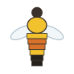 | *Bombus huntii* | `yellow,yellow,orange,orange,yellow,black,black` |
|  | *B. terricola* — yellow-banded | `yellow,black,yellow,yellow,black,black,black` |
|  | *B. occidentalis* — western | `yellow,black,black,yellow,white,white,white` |
| 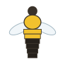 | *B. vagans* — half-black | `yellow,yellow,yellow,black,black,black,black` |
| 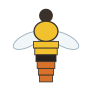 | *B. mixtus* — brown-tailed | `yellow,yellow,yellow,black,orange,orange,orange` |
| 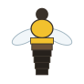 | *B. griseocollis* — brown-belted | `yellow,yellow,brown,black,black,black,black` |

**The bench draws the bee as you type it.** That is the point rather than a
decoration: a band code entered blind is unverifiable, and a bee drawn from it
can be held against the plate. A colour outside the palette renders as red
hatching, so a typo looks wrong instead of looking plausible.

Bumblebees are genuinely variable across their range — *B. rufocinctus* alone
runs through half a dozen colour forms — so record the form you actually have,
and put the source in the citation.

---

## Flight style — `flight_style`

The one character here you can record **from ten metres away without a
photograph**, and the one that drives the animation.

| | Term | What it means |
|---|---|---|
|  | `fluttery` | Loose, irregular flapping with constant small direction changes. Whites and sulphurs. |
|  | `erratic` | Sharp, unpredictable jinking — hard to follow, and hard for a bird to catch. Blues and crescents. |
|  | `darting` | Very fast, short, straight dashes with abrupt stops. Skippers. |
|  | `gliding` | Long sails between slow beats, holding a line. Monarchs and swallowtails. |
|  | `bobbing` | A rising and falling track, like a bouncing ball. Fritillaries and satyrs. |
|  | `hovering` | Holds station in mid-air at a flower instead of landing. Sphinx moths and clearwings. |

Those drawings are made from the *same* layered wander the viewer flies, so the
picture is the behaviour rather than an impression of it.

---

## Wing shape — `wing_shape`

Look at the **outline**, ignoring colour. Corners or curves first; then how much
wing there is relative to the body; then the two special cases that name a group
on their own.

| | Term | What it means |
|---|---|---|
| 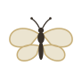 | `rounded` | No corners — the outline curves the whole way round. Most blues and fritillaries. |
| 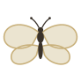 | `broad` | Large and wide relative to the body, built for sailing. Monarchs, admirals. |
| 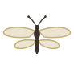 | `narrow` | Long and slim, a high-speed wing. Sphinx moths and clearwings. |
| 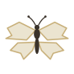 | `angular` | Straight edges meeting at corners, often a ragged margin. Tortoiseshells, anglewings. |
|  | `falcate` | The forewing tip is hooked and curves back toward the body. |
| 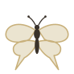 | `tailed` | A tail projects from the hind wing. The swallowtail mark, readable across a garden. |

## Wing pattern — `wing_pattern`

**The distinction that matters is `spotted` vs `eyespots`:** a spot is a solid
disc, an eyespot has concentric rings and usually a pale highlight. It is the
difference between a marking and a bluff, and it identifies the big silk moths
and the satyrs.

| | Term | What it means |
|---|---|---|
| 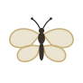 | `plain` | One colour, no figure on it. |
| 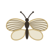 | `veined` | The veins picked out in a contrasting colour. |
|  | `spotted` | Discrete round spots, solid, no ring. |
|  | `banded` | Stripes across the wing, parallel to the outer margin. |
| 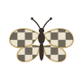 | `checkered` | A grid of alternating light and dark. Crescents, checkerspots. |
| 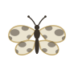 | `mottled` | Irregular soft-edged blotches, usually camouflage. Most moths. |
|  | `eyespots` | Concentric rings with a highlight, imitating an eye. Polyphemus, wood-nymphs. |

## Resting posture — `resting_posture`

What you see on a perched animal, and often easier to record than anything about
the wing itself.

| | Term | What it means |
|---|---|---|
| 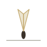 | `wings_up` | Held together vertically over the back. The butterfly default. |
| 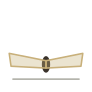 | `wings_flat` | Spread open against the surface, usually basking. |
| 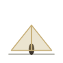 | `tent` | Sloped over the abdomen like a roof. Most moths. |
|  | `wrapped` | Rolled tightly around the body, cigar-shaped. |
|  | `swept` | Angled back along the body like a jet. Sphinx moths. |

## Bee build and pollen-carrying

| | Term | What it means |
|---|---|---|
| 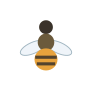 | `round` | Broad and globular, densely furred. Bumblebees. |
| 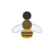 | `stout` | Thickset and compact. Digger and mason bees. |
| 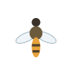 | `slender` | Narrow and elongate, often small. Sweat and mining bees. |
| 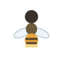 | `leafcutter` | Broad head, flat parallel-sided abdomen carrying pollen underneath. *Megachile*. |
| 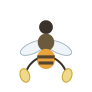 | `hind_leg` | Pollen in a brush or basket on the hind leg. Most bees. |
|  | `abdomen` | Pollen under the abdomen — bright yellow from below. *Megachile*, *Osmia*. |
|  | `none` | No brush at all — the **cuckoo bee** field mark. A bee that lays in another's nest never carries pollen home. |

---

## Reading a guide into the catalogue

| The guide says | Field |
|---|---|
| "wingspan 45–65 mm", "FW length 24 mm" | `wingspan_min_mm` / `wingspan_max_mm` — keep the **range** |
| "length 12–17 mm" (bee) | `body_length_mm` |
| "T1 yellow, T2–3 orange, T4 yellow" | `band_pattern`, thorax first |
| "hind tibia with pollen basket" | `scopa_position: hind_leg` |
| "scopa ventral" / "carries pollen beneath" | `scopa_position: abdomen` |
| "cleptoparasitic", "cuckoo" | `scopa_position: none` |
| "metallic green", "blue-black" | `metallic: yes` + `integument_colour` |
| "wings smoky", "infuscate" | `wing_tint: smoky` |
| "hindwing tailed", "falcate apex" | `wing_shape` |
| "eyespot on each hindwing" | `wing_pattern: eyespots` + `eyespot_count` |
| "rests with wings tent-like" | `resting_posture` |
| "flies rapidly, low over vegetation" | `flight_style` |

### What to skip

Genitalic characters, wing venation cell names, antennal segment counts,
instar descriptions, and the parts of a key that separate species by dissection.
Nothing reads them and nothing is planned to. Put anything you want to keep in
`notes`.

---

## Not yet drawn

`wing_pattern`, `eyespot_count`, `resting_posture`, `scopa_position` and
`wing_tint` are **recorded and validated but do not yet change the 3D preview.**
A first attempt at laying eyespots and bands on the wing as procedural decals
was written and removed: the marks attached and positioned correctly and would
not render — a coplanar-decal ordering problem that resisted the usual fixes
(polygon offset, depth test, explicit render order) inside a reasonable budget.

The data is not wasted: it is what the bench edits, what the field guide
teaches, and what a plant-and-animal identification lesson (F83) would use. The
geometry is logged as follow-on work rather than left half-built.

## See also

- [`BOTANY_FIELD_GUIDE.md`](BOTANY_FIELD_GUIDE.md) — the same, for the plants.
- [`DATA_GAPS.md`](DATA_GAPS.md) — what the catalogue does not know yet.
- [`DATA_SOURCES.md`](DATA_SOURCES.md) — what may be copied from where.
- [`3D_SPRITES.md`](3D_SPRITES.md) — how these characters become geometry.
