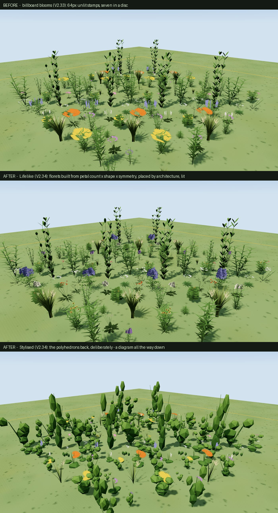

# Sprite accuracy audit — V2.29

> **Status: all five ranked improvements below have since been built, plus a
> second pass on grass, fern, pine and the poplar/aspen split, and a third pass
> (V2.33) that closed everything the second left open — and found the worst
> defect in the library, which this audit missed and a user did not.** The
> scores and per-archetype notes are kept as written, as the record of what was
> wrong and why — see [What changed](#what-changed-after-this-audit),
> [Second pass](#second-pass--grass-fern-pine-poplar) and
> [Third pass](#third-pass--v233-roadmap-f63f69) for what each fix actually
> did, what regressed on the way, and what is still open.
>
> The headline of the third pass is worth stating up front, because it is a
> lesson about this audit as much as about the geometry: **every broadleaf's
> crown was built out of leaf cards 13–15× life size, and no check anywhere
> looked at how big one leaf was.** Triangle budgets, node names, the manifest,
> the unit frame, the authored aspect and the headless render gate all passed
> throughout. The bur oak — widest crown, largest leaf, and the only *lobed*
> outline in the table — drew 2.6 m leaves on an 18 m tree, and a user described
> it in one word.

An honest, per-archetype assessment of how well the 3D preview's plant sprites
represent the species they stand for, what is wrong with each, and what it would
take to fix it.

**Method.** Every archetype and flower form was rendered headless through the
real viewer (`html/sprite_gallery.html?sprite=<key>`, Chromium + SwiftShader) at
July, year 0 — the same path the in-app gallery uses, so these are the sprites
the app actually draws, not a mock-up. Renders were then compared against
reference photography for the named exemplar species. The full 441-tile contact
sheet was used to judge *distinctiveness*, which is the thing single-specimen
review cannot see.

**Scoring.** 0–10, against the question the app actually needs answered: *would
someone who knows this plant recognise it, and would they tell it apart from its
neighbours in the bed?* Not "is it photorealistic" — the target is a legible
stylised model, and a score of 7+ means the sprite is doing its job.

Two numbers, because they fail independently:

- **Fidelity** — does it look like the species?
- **Distinctness** — is it different from the sprites next to it?

---

## Summary

| | Fidelity | Distinctness |
|---|---|---|
| Deciduous trees | 6 | **3** |
| Conifers | 6 *(pine →6)* | 5 *(pine →7)* |
| Shrubs | 6 | 5 |
| Wildflower bodies | 6 | 6 |
| Flower heads | 6 | 7 |
| Grasses / sedges | 4 *(→6 mesh)* | **2** |
| Ferns | 3 *(→6)* | 5 *(→6)* |
| **Groundcover** | **1** | **1** |
| Fruit *(after this release)* | 7 | 7 |
| Creatures | 5 | 6 |

**The single worst thing in the library is the groundcover mat.** It is a lump
of untextured faceted polygons with no leaves at all — the only archetype the
V2.29 leaf work never reached. 32 species render as it, including both wild
strawberries, bearberry, bunchberry and all five creeping *Rubus*. The
strawberries you flagged look bad because the fruit was a sphere (fixed) sitting
on a green boulder (not fixed).

**The most pervasive problem is distinctness, not fidelity.** Individual sprites
are mostly acceptable; the library has far fewer distinct looks than it has
species, and the contact sheet makes that obvious in a way the old one-at-a-time
menu could not.

---

## Why so many look the same

This is a data-shape problem, not an art problem, and it is worth stating
precisely because it determines what "improving the sprites" costs.

**Trees resolve by GENUS, and there are only 11 genus profiles.**
`TREE_PROFILES` (`html/scene3d/02-plants.js:376`) maps *Picea, Abies,
Pseudotsuga, Pinus, Larix, Populus, Betula, Quercus, Salix, Prunus, Malus* to
eleven parameter bags — a bark hex, a crown-form bias, a foliage scale. Every
species inside a genus is byte-identical geometry. So:

- Pin Cherry, Chokecherry, Evans Cherry and Nanking Cherry are **one sprite**.
- Goodland Apple and Norland Apple are **one sprite**.
- Cherry and apple differ from each other only by `formBias` (oval vs spreading)
  and a bark hex — which is why, in the contact sheet, Evans Cherry, Goodland
  Apple and Norland Apple are three near-identical green blobs on trunks.

**Shrubs resolve to 5 silhouettes.** 56 shrub species → `vase | spreading |
mound | thicket | irregular`. Since V2.29 they also vary by (blade class × grain
class × arrangement), which genuinely helps, but a saskatoon and a pin cherry
sitting at similar heights still read alike because the *branch architecture* is
the same builder with different numbers.

**Herbs resolve to ~9 growth forms × 15 flower forms.** 75 of those 135 pairs
actually occur (the new **Body × flower combos** gallery group is exactly this
list). That is the real vocabulary of the app: **~75 distinguishable plant looks
for 436 species.**

That ratio is the honest headline. Nothing about triangle budgets or hardware
caused it.

---

## Per-archetype notes

### Groundcover mat — fidelity 1 · distinctness 1
A cluster of flat-shaded convex domes. No leaves, no stems, no structure. Every
groundcover in the catalogue is this shape at this colour; only the fruit
sprites differentiate them at all.
**Fix:** it needs the treatment herbs and shrubs already got — real leaves from
`leaf_shape`/`leaf_size_cm`, on runners for the stoloniferous ones. Wild
strawberry is *trifoliate* and *basal* and the data already says so; nothing
reads it. This is the highest value-per-hour fix in the library.

### Grass / sedge / rush tuft — fidelity 4 · distinctness 2 *(→ 6 · 2, see second pass)*
A narrow, near-vertical paintbrush of blades. Big bluestem is 1.6 m and should
arch out into a broad fan; this barely spreads. Blades are sub-pixel thin at
scene distance, so a tussock reads as a dark smudge. 51 grass + 20 sedge + 8
rush species share it, separated only by height and (in season) a `plume`.
**Fix:** widen the arch, thicken blades, and split at least *tussock* vs
*rhizomatous* vs *sedge triangular-culm* habits. Seed heads matter more than
blades for ID and are currently one generic plume.

### Fern — fidelity 3 · distinctness 5 *(→ 6 · 6, see second pass)*
Fronds are undivided lance blades, so the one thing that makes a fern a fern —
pinnate division — is absent. Too dark and too vertical; ostrich fern is a
broad arching vase.
**Fix:** `add_compound_leaf` already exists in the generator and is used for
pea/rose leaves. Ferns should use it (bipinnate), arch harder, and lighten.

### Pine — fidelity 4 · distinctness 6 *(→ 6 · 7, see second pass)*
Flat hexagonal plates stacked on a bare pole. Jack pine's actual character —
irregular open tufts at branch ends, scraggly asymmetry — is not there; the
plates read as a pagoda.
**Fix:** needle tufts at branch tips rather than horizontal discs. The other
conifers (spruce/fir 6/10, larch 6/10) are better because a stacked-cone skirt
genuinely is roughly right for them.

### Deciduous trees — fidelity 6 · distinctness 3
Crowns are much improved since the V2.29 rebuild (real boughs, deep crowns,
sensible trunk girth). Oak reads as a broad gnarled oak. But aspen/birch/cherry/
apple/willow differ mainly in bark hex and crown proportion.
**Fix:** the cheap win is not geometry — it is *leaf shape at silhouette scale*
and *branch angle*. Birch twigs pendulous and fine; aspen leaves fluttering flat
discs on flat petioles; oak leaves lobed and clumped. Second: apple and cherry
need blossom and fruit to be different sprites, which the new `fruit_form` now
partly delivers.

### Shrubs — fidelity 6 · distinctness 5
Much better after the double-sided fix and the ~600-leaf rebuild. Dogwood
(red stems, opposite ovate leaves) and currant (dense, lobed, berried) read
correctly. Weakest case is a tall shrub — a 5 m chokecherry spreads ~600 leaves
over a large crown and thins out.
**Fix:** scale leaf count with plant volume rather than a flat budget, and give
`vase` a distinct branch angle from `thicket`.

### Wildflower bodies — fidelity 6 · distinctness 6
The best-served group, because V2.29 gave them per-species blade class, grain
class and arrangement. Lupine (palmate), bergamot (opposite), bedstraw
(whorled), crocus (dissected) are genuinely distinguishable.
**Fix:** stems are still uniform vertical rods; real forbs branch. Basal
rosettes are too flat.

### Flower heads — fidelity 6 · distinctness 7
15 canvas sprites, camera-facing. Daisy, pea, cattail, plume and umbel read
well. The weakness is that they are **billboards**: they always face you, so a
bed of asters is a wall of discs with no sense of which way the flowers point,
and heads never nod, droop or turn.
**Fix:** the biggest single improvement is orientation — let a head have a
normal and tilt (a nodding onion should nod). That is a geometry change, not a
texture change.

### Fruit — fidelity 7 · distinctness 7 *(this release)*
Was 2/2: one sphere for all 43 species. Now nine shaped sprites driven by
`fruit_form`. Strawberries are conic and pipped, hips are urns with crowns,
chokecherry hangs in racemes, pin cherry on long pedicels.
**Remaining:** sprites are still flat billboards, and the calyx/stalk is drawn
in the same grey ramp as the flesh so it takes the fruit's tint — a green calyx
would need a second material.

### Creatures — fidelity 5 · distinctness 6
Now that they fly nose-first they read far better. Bee, butterfly, bird and
hare are distinguishable. Wings flap; bodies are simple ovoids.
**Fix:** more variation within a kind (a bumblebee is not a honeybee), and
per-species wing colour for the leps.

---

## What it would take to level up

You asked whether to move past "low-poly so it runs on any hardware" toward
something that looks better and still works on a mid-range laptop. Honest
answer: **the current bottleneck is not the hardware budget.**

The whole plant library is ~30 archetype GLBs at 1200–3600 triangles each. A
typical yard draws maybe 60–150 instanced plants — call it 300k triangles. A
2019 integrated GPU handles several million. **We are using a small fraction of
what a weak laptop can do**, so "low-poly for compatibility" is not currently
what is limiting fidelity. Variety is.

Ranked by value per unit of effort:

**1. Fix the groundcover archetype.** (Small.) One builder, reusing machinery
that already exists. Takes the worst thing in the library from 1/10 to ~6/10 and
fixes 32 species including the strawberries.

**2. Species-level leaf silhouettes for trees.** (Medium.) Trees already read
their `leaf_shape` and `leaf_size_cm` for foliage *grain*, but the foliage mass
is a faceted blob. Making the outer crown a shell of actual leaf cards shaped by
`leaf_shape` would separate birch from aspen from cherry without touching the
genus table. Costs triangles — but we have them.

**3. Give flower heads orientation.** (Medium.) Replace camera-facing points
with small oriented quads carrying a normal and tilt. Nodding onion nods,
sunflowers face the sun, spikes stand up. This is probably the largest
perceived-quality jump per triangle in the whole viewer.

**4. Break the genus tables into species tables.** (Large but shallow.) The
mechanism is already there — `TREE_PROFILES` is just a dict. The work is
*authoring*: ~17 tree and 56 shrub species each need a handful of honest
parameters. This is data entry with a botanical reference, not engineering, and
it is what actually fixes "the saskatoon looks like the pin cherry" at the root.

**5. Textures.** (Large, and the real "level up".) Everything is flat-shaded
vertex colour today — no bark texture, no leaf texture, no normal maps. A single
shared 512×512 atlas for bark/leaf/needle would transform the look at almost no
runtime cost, and is well within a mid-range laptop. This is the step that moves
the app from "diagram" to "illustration". It is also the biggest chunk of asset
work, and it is worth doing *after* 1–4, because texturing a library that has 75
distinct looks just makes 75 nicer-looking repeats.

**What I would NOT do:** raise triangle budgets much further, or chase
photorealism. The app's job (P5) is to make ecology legible, and a
clearly-drawn, correctly-proportioned, correctly-*different* plant does that
better than a detailed one. The gap between the preview and reality is currently
about **variety and structure**, and no amount of polygons closes it.

---

## What changed after this audit

All five, in the order ranked above.

**1 · Groundcover rebuilt** (`assetlib/flora_herbs.py:_layer_groundcover`).
Stolons radiating from a crown, 150–350 real leaves per mat, basal rosettes
distinguished from trailing carpets, morphology-keyed into 9 units so a
strawberry gets a trifoliate mat and a bearberry an elliptic one. Its own
triangle budget (1600) because it is the only layer you look straight down at.
**1/10 → ~6/10**, and 32 species with it.

**2 · Tree crowns carry their species' leaf**
(`assetlib/flora_trees.py`, `conventions.DECID_LEAF_SHAPE`). The outermost
clumps — the ones that make the silhouette — are rosettes of real leaf cards
instead of faceted ellipsoids; interior clumps stay spheres, where nobody can
see them and volume is cheapest. Cost-neutral by construction. Oak, birch,
aspen and cherry now differ in outline, not just bark hex.

**3 · Flower heads are oriented** (`05-flowers.js:_FLOWER_ATTITUDE`). Instanced
quads, each held at the attitude its form actually holds, with the attitude
decided by the viewpoint its texture is drawn from. Spikes stand, umbels
present upward, bells hang. Orbiting the view no longer slides the meadow
around like decals.

**4 · Species characters beat genus tables** (`03-herbs.js:treeFormFor`).
`formBias` became the fallback its own docstring always said it was rather than
an override, so a 20 m paper birch and an 8 m water birch stop being the same
shape; and `branching` (schema v47) is finally emitted and read, so a
multi-stemmed water birch or Bebb's willow is a broad clump rather than a
single-leadered spire.

**5 · Surface detail** (`02-plants.js:makeDetailTexture` / `plantMaterial`).
Procedural bark fissures and foliage mottle, sampled in object space with a
per-instance offset. Procedural rather than UV-mapped images because the baked
GLBs carry no texture coordinates and a test forbids them embedding textures —
and because instanced meshes would repeat one UV set identically anyway.

## Second pass — grass, fern, pine, poplar

**6 · The blade primitive could not arch.** `add_blade` climbed at a constant
rate (`z = height * t`) and displaced sideways: that is a *lean*, and no
authored value bends a straight line. This is why the tuft read as a shaving
brush and the fern as a bundle of uprights, and why the first attempt at
fixing the grass — widening the authored lean range — changed nothing visible.
Worse, it made the median blade *straighter*, because `_blades` normalises the
tuft against its widest member. `mesh_ops` now integrates a turning tangent
(`_arc_table` / `arc_extent`), `_blades` bisects the tuft's spread on the real
extent, and the same arc bends a compound rachis. Guarded by
`tests/test_model_assets.py:ArcBladeTest`, which fails on the old lean.

**7 · Grass — 4/10 → 6/10 for the mesh, unchanged on screen for tall species.**
The unit is now a genuine fountain (measured aspect 1.40 against a 1.31
target) and a species whose real proportions match it, like prairie dropseed
at 0.7 m × 0.9 m, renders as one. Big Bluestem still renders narrow, and that
is *correct*: it is recorded 1.6 m × 0.5 m, so the instance transform stretches
the 1.31 unit to 3.2. See "Still open" — this is an archetype/species mismatch,
not a builder bug, and no amount of tuft authoring fixes it.

**8 · Fern — 3/10 → ~6/10.** Fronds are divided (seven pinna pairs, overriding
the three that `compound_pinnate` means for a rose) and arched. Two things had
to change beyond dividing them: the rachis needed the arc, and the pinnae
needed to stand out square from it (`leaflet_flare`) — at the rose's forward
angle a divided frond is still a narrow brush, because leaflets pointing where
the rachis points add nothing to the silhouette. The plant is still thin: 16
fronds is what the 1200-triangle herb budget buys at 68 triangles a frond.

**9 · Pine — 4/10 → ~6/10, after a regression.** Needle fascicles replaced the
flat ellipsoid pads, and the first cut was *worse than what it replaced*: at
true proportion (3% of length) a jack pine's needle is sub-pixel on a 15 m tree,
so the crown aliased into a bottle brush of dark wires. One ribbon now stands
for a shoot's spray of needles (`NEEDLE_FASCICLE_GAIN`), and the crown carries
23 tufts instead of 14. 2120 triangles against a 3500 budget.

**10 · Poplar split from aspen** — the one genuinely unambiguous win here.
`tree.poplar` is its own archetype with its own crown aspect (2.1 vs the aspen's
2.7) and leaf (ovate 10 cm vs orbicular 6 cm), reached by species rather than
genus. Balsam poplar is now a broad dense crown and trembling aspen a slender
open one; they were pixel-identical before.

### Still open *(after this audit — see the third pass below for what closed)*

- **Fern density** is budget-bound, not shape-bound. A lusher crown needs either
  a higher herb budget or a cheaper frond.

## Third pass — V2.33 (roadmap F63–F69)

Every remaining item on the list above closed, and one defect this audit never
caught was found by a user and measured.

**11 · The leaf cards were 13-15x life size, and the bur oak was the worst
case.** A user reported the oak "looking ridiculous". It was: measured off the
shipped GLB, its crown-edge cards ran **2.6 m on an 18 m tree** against a real
bur oak leaf of 0.20 m. The cause was in `flora_trees._build_deciduous` — a
card's length came from the CLUMP RADIUS it replaced and nothing tied it to
`leaf_size_cm` — and the oak maximised every term at once: the widest crown
(aspect 1.2, so the largest `crown_half`), the largest leaf (20 cm, pinning
`grain_for` at its cap), and the only `lobed` outline in the table. A rounded
aspen blob at the same 14x error still reads as *foliage*; an unmistakably lobed
oak leaf at 2.6 m reads as a green oven mitt.

It had a second symptom nobody had connected to it. `half_width` is measured off
the widest geometry and the viewer divides the instance by it, so a sparse
fringe of outsized cards set the divisor while the dense crown sat well inside
it: the oak's p90 foliage radius was **58% of its half-width**, so an 18 m bur
oak with a 15 m canopy rendered about 8.7 m across — a narrow column, not the
broad spreading oak the archetype is authored as. One cause, two symptoms, and
the fix moved the dense-crown figure to 69-75% across the family.

Cards are now `LEAF_CLUSTER_GAIN` real leaves long — a leafy SHOOT, the same
trade the pine's needle fascicles make — with a legibility floor *solved* from
the crown's surface area and the tier's triangle budget rather than guessed, so
raising the budget automatically buys finer leaves. The faceted filler
ellipsoids went with them: they were invisible only because the paddles hung in
front of them, and at life-sized leaves the budget buys 600+ per crown, which
fills the volume as well as it clothes the surface. Tree budgets rose 3500 →
6000 at tier2, which the audit's own conclusion says was always affordable.
**Guarded**: `test_crown_leaf_cards_stay_in_scale_with_the_species_leaf`,
verified to fail on 5 of the 7 pre-V2.33 broadleaf archetypes (oak 14.1x,
poplar 19.8x, aspen 14.9x, birch 12.0x, cherry 10.2x) and pass on all 7 after.

**12 · Textures — the audit's item 5, the "real level up".** Ten procedural
surface classes instead of two (F63): bark smooth / furrowed / papery / shaggy /
scaly, leaf matte / glossy / pubescent / glaucous, and needle. A species picks
its class from the catalogue (`bark_texture`, `leaf_surface`, schema v52), so a
paper birch peels horizontally, a bur oak furrows vertically and a wolf-willow
reads silver. Foliage sampling went triplanar; the two-plane blend smeared on
any leaf card facing the third axis, which is most of them.

**13 · Species tables where genus tables lied (item 4, finished).** Jack pine
split from lodgepole, water birch from paper birch, pin cherry from Evans,
Douglas-fir from balsam. Shrubs resolve their silhouette from the species' own
`branching` — 100% seeded and read by nothing — with three new forms the genus
table could not express: `prostrate` (creeping juniper and Oregon-grape were
drawing as UPRIGHT bushes, a correctness bug), `arching`, `upright`. White and
black spruce are deliberately NOT split: their recorded aspects are both 3.3, so
a separate archetype would be a fabricated difference (P9). 11 genus profiles
→ 19 tree archetypes, 5 shrub silhouettes → 8.

**14 · The archetype-vs-species aspect gap, closed for layers.** grass, aquatic
and vine always shipped three units and the three were random draws of one shape
picked by a plant-id hash. They are three real aspect classes now, chosen by the
species' own height ÷ canopy — **at zero payload cost**. Big Bluestem's residual
stretch fell from 1.53x to 1.12x.

**15 · Grass seed heads.** Eight inflorescence forms (`inflorescence_form`,
schema v52) across 78 of the 79 graminoids: turkey-foot, one-sided raceme, open
panicle, contracted spike, nodding raceme, bristly, sedge cluster, rush umbel.
Drawn rather than baked, because a seed head is seasonal — and held from
flowering through winter, which is most of what a prairie grass contributes to a
yard from October to April.

**16 · Creature variety within a kind.** Four bee body plans, four lepidopteran
wing plans, three bird outlines. The reason this outranks its cosmetic
appearance: **62 of the 69 native bees have no photograph** and will not get one
under the licence policy, so where there is no photo the model is the whole
identification.

**17 · Wind that blows from where the wind blows.** The site's real seasonal
prevailing wind drives sway direction and amplitude; the design's own windbreaks
damp the plants standing in their lee, via a shelter grid rasterised Python-side
and sampled as one shared texture. A material's wind constant became an explicit
stiffness class — a spruce barely moves in wind that has a grass lying flat.

### Still open after the third pass

- ~~**Herb aspect.**~~ Closed in the fourth pass below.
- **Shrub aspect within a silhouette.** `arching` spans 0.4 (skunk currant) to
  1.67 (raspberry); the median serves neither end well.
- **Fern density**, unchanged from above.
- **Fruit and flower sprites are still flat billboards**, oriented since V2.29
  but not modelled.

## Verification note

Scores in the per-archetype table come from close inspection of individual
renders for: pine, spruce, oak, aspen, grass, fern, groundcover, daisy, saskatoon,
dogwood, currant, rose, strawberry, chokecherry and pin cherry; plus the full
441-tile contact sheet for cross-comparison. The remaining archetypes were judged
from the contact sheet alone, at thumbnail scale — adequate for distinctness,
weaker evidence for fidelity, and flagged here rather than presented as equally
grounded.

## Fourth pass — V2.34 (herb aspect · Stylised · the uncanny valley)

This pass started from a user observation that turned out to be the most useful
diagnostic note in the whole audit: **the preview reads as "a really low quality
video game", and the old polyhedrons were *more forgiving*.** Both halves are
correct, and together they explain the shape of the problem.

The polyhedrons were **coherent**. A faceted green mass is a confident
abstraction — it says "this is a diagram of a shrub" and the eye accepts it.
What V2.29–V2.33 built is geometry that *attempts* realism: real leaf blades,
real branch skeletons, real bark grain. The moment a scene claims realism, the
eye starts grading it against a real plant — and then everything still abstract
reads as **broken rather than stylised**. That is the uncanny valley, and the
scene had walked into it.

**18 · Herb aspect axis.** The item left open above, closed. `HERB_ASPECT_CLASSES`
gives the six aspect-carrying growth forms three classes each at the median of
each tertile of their species' real height ÷ canopy, and the herb variant key
grew a third segment (`broad_1_a2`). **169 of the 228 species on the axis move
off their form's single authored figure, and the median proportion error falls
from 28% to 11%** — a creeping phlox at 0.11 and a blazingstar at 3.33 were both
being drawn at four and three times the wrong shape. 52 units → 96, 2.5 MB →
4.4 MB, because only the (blade × grain × aspect) triples the catalogue actually
uses get baked. `fern` is deliberately left off the axis: one species maps to it,
and a class it cannot fill would be a fabricated difference (P9).

**19 · Stylised is a style, not a thinning.** Detail level 0 no longer means
"the same look with fewer triangles" — it skips the baked model library, drops
the surface textures, flat-shades everything and builds forbs as faceted masses,
so it is diagrammatic all the way down. The three levels are now **Stylised /
Balanced / Lifelike**, because "Low" told the user it was worse when it is a
choice — and it remains by far the cheapest scene the app can draw. Herbs needed
a new builder (`13-stylised.js`) because `buildPerennialGeo` had no faceted path
at all: all level 0 ever did to a forb was build it out of fewer blades, which is
the sparse-realism failure this mode exists to avoid.

### Where the remaining gap actually is

Measured rather than argued, because the instinct is to keep working on leaves:

| | |
|---|---|
| Wildflower + herb species | **228** |
| Distinct `(growth_form × flower_form)` looks | **51** |
| Species sharing "erect × spike" | **31** |
| Wildflowers in a bucket of 5+ identical looks | **154 of 228** |
| Distinct `flower_color` values across all of them | **19** |
| Flower images in the whole app | **15**, one per form |
| Resolution of each | **64 × 64 px** |
| Flower material | `MeshBasicMaterial` — **unlit** |
| Bloom quads per plant | 7, sqrt-spaced in a disc at 90% height |

**A forb in bloom is 60–80% flower to the eye, and the flower is a 64-pixel
stamp in one of nineteen flat colours.** The body underneath it now carries real
leaves at 1,200 triangles. That gap — realistic body, cartoon bloom, unlit — is
what reads as a cheap video game, and no further work on leaves will move it.

**20 · The bloom is geometry (schema v53).** The gap above, closed in the same
release. A flower is now built from the characters someone standing in front of
it would name — **petal count × petal shape × radial/bilateral symmetry**, plus
a **separate disc in its own colour** — and placed by one of **nine
inflorescence architectures** (solitary · raceme · spike · panicle · corymb ·
umbel · head · cyme · whorl) rather than as seven identical quads scattered in a
disc. **307 of 311 flowering species (99%)** are described, family-first, in
`scripts/seed_flower_morphology.py`.

Three things this fixes that no amount of leaf work could:

- **The bloom takes light.** It was on `MeshBasicMaterial`, which is unlit — a
  bed of flowers was the same flat colour at noon, at dusk and in the shade of
  the tree beside it.
- **A bloom is its own size.** `flower_diameter_cm` is the most valuable number
  the catalogue was missing: bloom size used to be derived from the plant's
  CANOPY, so a pasqueflower and a sunflower scaled with the plant rather than
  with the flower. A black-eyed Susan head is now 7 cm across because a
  black-eyed Susan head is 7 cm across.
- **A pea is not a daisy.** Bilateral flowers get a banner, two wings and a keel.
  Drawing them radially is the commonest way a generated flower gives itself
  away, and 40-odd Fabaceae and Lamiaceae species were doing exactly that.

`flower_form` is untouched and is **not** widened: it feeds
`bee_habitat.tongue_form_fit` and `forage_calendar`, where it is a
pollinator-access statement rather than a picture. Same separation
`inflorescence_form` took in v52. Where the new fields are empty the viewer
draws the old billboard, so partial coverage degrades to the previous release
rather than to a hole (P9).

*The same 121-plant, 20-species bed, same camera, year 3, July. Top: V2.33's
billboards — flat orange and yellow plates lying in the air, taking no light.
Middle: Lifelike — lupine racemes on their stems, yarrow corymbs as flat white
plates, black-eyed Susans at their real 7 cm with a dark disc. Bottom: Stylised,
which is not the middle one degraded but a different answer to the same scene.*

**21 · Forb stems fork (V2.34).** `stem_branching` had been recorded on every
described species since v53 and **nothing read it**: `flora_herbs.build_herb`
stamped each stem as one `rot @ Vector((0,0,h))` segment. A goldenrod's
silhouette *is* its two orders of branching, and drawn as a single pole it
becomes a blazingstar. The stem is a skeleton now — forking low and wide for
`branched_throughout` (an aster, a sunflower), holding a clean stem and opening
only at the top for `branched_above` (a goldenrod, a bergamot), staying a rod
for `unbranched` — and leaves are distributed along it in proportion to segment
length, so a plant that puts most of its length into three top branches gets
most of its leaves there.

Only `erect` and `clump` take the axis; the other five forms are basal-leaved
with bare scapes and have nothing to fork (P9). 96 units → 112, 4.4 → 5.5 MB.

The one non-obvious cost: **a stem segment and a leaf come out of the same
1,200-triangle allowance**, and `thin_leaf_nodes` spends stems first. The first
build let a six-stemmed clump fork twice per stem, put ~40 cones on the plant
and thinned its foliage to 328 triangles — which renders as a bare wire spray.
Branching is budgeted per plant now, so a clump of six gets a simpler skeleton
each than a single erect stem does. The spray is the whole plant, not each stem
of it.

**22 · A bloom count that comes from the plant (schema v54).** How many
inflorescences a mature plant carries is most of what "in full bloom" looks
like, and the viewer was deriving it from CANOPY — a proxy for spread, not for
flowering. `flowering_stems` records it; where it is empty the fallback is now
the **branching habit** (one head per stem when the stem doesn't fork, one per
branch tip when it does), which is at least a structural consequence rather than
a guess. Both are scaled by the plant's own growth, so a first-year plug does
not flower like an established clump.

No flora records this number. The seeded values follow from the branching habit
with per-genus corrections where a plant is conspicuously more or less
floriferous than its habit implies — a pasqueflower holds three, a mature
bergamot twenty-eight, an annual sunflower exactly one. **They are estimates,
and the tuning bench exists to correct them.**

### Still open after the fourth pass

- **Shrub aspect within a silhouette**, unchanged from the third pass.
- **Fern density**, unchanged.
- **Fruit is still a billboard**, unchanged.
- **The four field numbers.** `flower_diameter_cm`, `petal_count`,
  `flowering_stems` and `flower_height_frac` are seeded from genus-level
  botanical judgement, not measured. They are the four floras skip and the four
  the generator most needs — see below.

## Fifth pass — V2.35 (the photographs, and admitting what is guessed)

Two things, and the second is the more important one.

**23 · Photo sets with named slots (F70, schema v55).** `plants.image_url` was
ONE slot, and `scripts/fetch_inaturalist_images.py` fills it with *the first
photo whose licence is redistributable* — which on iNaturalist is nearly always
a macro of a flower. So every photograph the app had was the frame that
identifies a plant to a botanist, and **not one was the frame that tells you
whether you want it in your yard**, or helps you find it there in May. With one
column, fixing that meant losing the other.

Seven slots now (`habit · flower · leaf · fruit · bark_stem · winter ·
seedling`), keyed by `scientific_name` because plant ids are not stable across a
reseed, with `image_url` synthesized on read from the best available one — so
the plant browser, the 3D dossier card and `photo_warm` all improve without a
line of change at the call site. `src/data_quality.py` counts **coverage** now,
not only licence compliance, which is how this became a number:

| | |
|---|---|
| Plants with no photograph at all | **111 of 434** |
| Species with a `habit` shot | **0** |
| Fauna with none | 84 of 142, including **62 of 69 bees** |

**24 · Your own photographs (F72), and they cannot be lost.** `origin='seed'`
vs `'user'` — the `polycultures` v46 pattern — so a reseed replaces the shipped
photos and never touches yours. Every import is downscaled to 1,600 px and
**has its EXIF stripped**, which is a privacy property rather than a nicety: a
photo of your own yard carries your home's GPS coordinates, and the natural next
step for a photo you are pleased with is to commit it somewhere public.

**25 · Provenance on every flower number.** This is the one that matters most
for this document's honesty. V2.34 reported "307 of 311 flowering species
described" — and 307 of those were the family-first seeder's **genus defaults**,
not measurements. `flower_data_source` (`estimated` / `photo` / `flora` /
`measured`) records the difference, and the count of *verified* species starts
at zero. Quoting the first number as though it were the second is exactly what
P9 forbids, and this audit was doing it.

### Where the numbers actually are

Worth writing down, because "go measure it" is not a plan for 434 species:

- **Flora of North America** has them — ray counts, laminae lengths, head
  diameters, outright, in the description. Vols 19–21 cover most prairie
  Asteraceae. Free to read, copyrighted, so a bulk scrape is out; a person
  reading it and typing "13 rays" is recording a **fact**, which is nobody's
  property. The bench links straight to it per species.
- **Budd's *Flora of the Canadian Prairie Provinces*** is the regional
  equivalent.
- **TRY** and **BIEN** are leaf/seed/height traits. Floral morphology is sparse
  to absent, and mostly not redistributable.
- **USDA PLANTS** is public domain and stops at bloom period and colour.

And the thing that changes the arithmetic: **most of these characters are
readable off a photograph.** Petal count, symmetry, petal shape, architecture,
disc colour, basal rosette and branching all are; flowering stems and bloom
height come off a habit shot. Only **diameter in cm** genuinely needs a ruler or
a flora. Which is why the photo library is not a parallel project to the
fidelity work — it is the input to it.

### Still open after the fifth pass

- **F73** (in my yard, on this date) — the `taken_on` column is in place, so it
  is UI work now rather than another schema bump.
- **F74** (the seedling sheet) — cheap to assemble, and it would print "no
  seedling photo" for essentially every species until that slot has content.
- **Shrub aspect within a silhouette**, **fern density**, **billboard fruit** —
  unchanged.

### What would move fidelity fastest from here (not code)

Ranked by value per hour, because the bottleneck is data, not geometry:

1. **Tune species against reference photos.** The generator is only as good as
   its numbers, and someone who knows these plants can fix a wrong one in the
   time it takes to look one up.
2. **Field-measure the four numbers floras omit**: flower diameter in cm,
   petal/ray count, *flowering stems on a mature plant*, and how far the flowers
   sit above the leaves. Floras give ranges for height and skip all four.
3. **Score renders blind** — "would you recognise this? 1–10" — so the audit's
   numbers are measured per release instead of argued about.
4. **Licence-clean photographs**, which the tuning in (1) needs as its
   reference and which roadmap F72 wants anyway.
