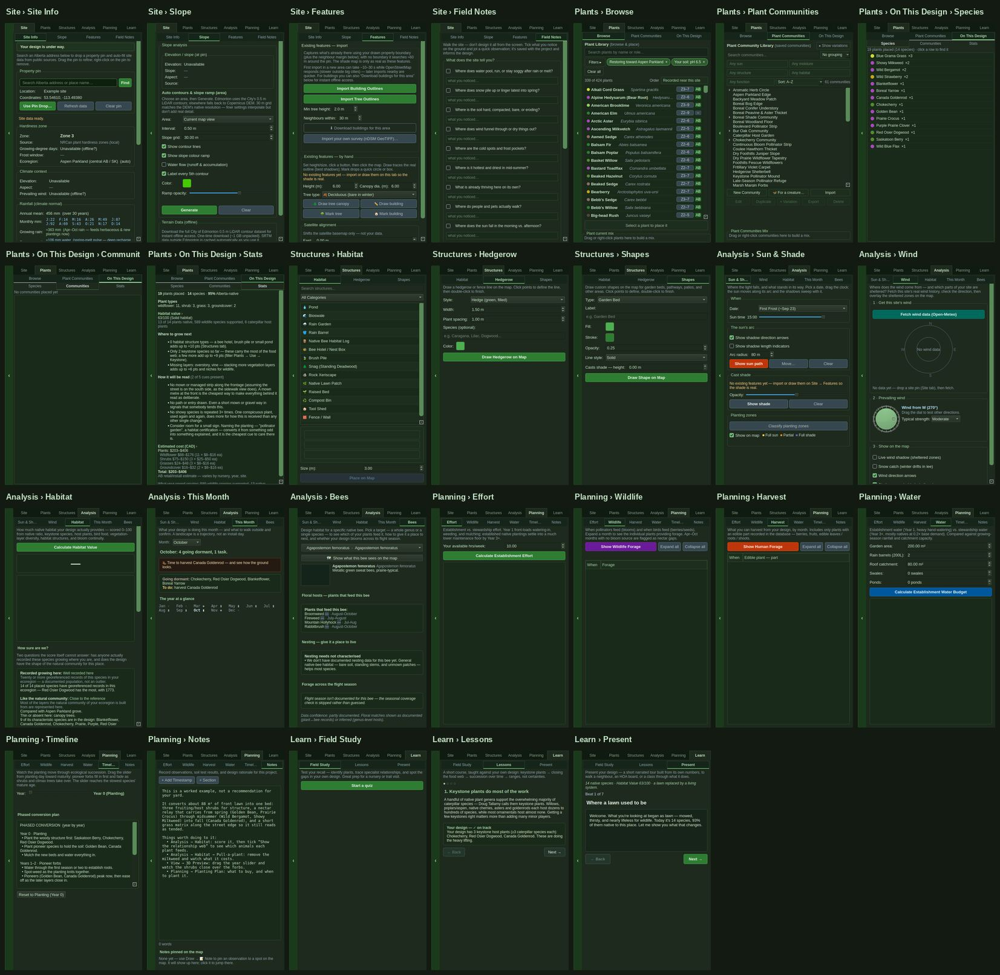

# Every surface, counted

*The retirement pass that F94 (a task-shaped home) and F89 (the 3D preview's
toolbar) both say must come before any restructure: **what is genuinely
load-bearing?** Written in V3.05. The owner decides every keep, merge, move and
retire below; the evidence is here so the decision does not have to be made from
memory.*

**Where the decisions are recorded.** A page made from this audit, readable on a
phone, keeps the owner's choice for every page and question below:
<https://claude.ai/artifact/Q57cbnchvARZBSgiiBojqE> (private to the owner). A
session reads them with the `ArtifactData` tool, `list` on the collection
`decisions`: one document per page (its id is the page's path in lower case,
`analysis-wind`) or question (`q-…`), holding `choice` (keep, merge, move, retire;
yes, later, no), `note` and `at`. Read them before restructuring anything; the
table below stays the reasoning, the page holds the answers.



## How it was measured

From the real window, not from the source and not from memory.
[`scripts/surface_inventory.py`](../scripts/surface_inventory.py) boots
`MainWindow` in a throwaway home folder, opens the worked example (19 plants, 14
species, a boundary and a pin), and:

- **walks every tab at every depth**, and records each control's kind, words,
  tooltip, screen-reader name, whether it is wired to anything, how far down its
  column it sits, and whether a person at 1366 × 768 must scroll to reach it;
  every page's words, its paragraphs, and a screenshot;
- **clicks every enabled button** and records what changed: a window or dialog,
  a question asked, the map told something, the design changed, the mode, the
  status line, controls appearing, text on the page changing, or nothing. Every
  dialog, question, file picker and web link is intercepted and cancelled, so
  nothing is saved, deleted or sent;
- **opens every window** on the View menu and **every dialog** the clicks and the
  File and Help menus reach, and photographs and inventories each.

At 1366 × 768, the most common laptop screen, in Liberation Sans (Arial's
metrics, which Windows text is close to), under a virtual X display on Linux.
Re-run it with:

```bash
QTWEBENGINE_CHROMIUM_FLAGS="--no-sandbox --ignore-gpu-blocklist" QT_QPA_PLATFORM=xcb \
  xvfb-run -a -s "-screen 0 1366x768x24" \
  python scripts/surface_inventory.py --out /tmp/surface --click --windows --dialogs
```

It writes `inventory.json` and a screenshot per page, window and dialog, and
prints a summary. The next pass can diff its JSON against this one.

## The numbers

The same probe, run on V3.04's code before anything here changed, and on V3.05's.

| | Before (V3.04) | After (V3.05) |
|---|---|---|
| Side-panel tabs | **6**, holding **26 pages**, up to **3 levels deep** (Plants › On This Design › Stats) | the same |
| Controls on those pages | **169**: 66 buttons, 28 checkboxes, 21 number boxes, 19 dropdowns, 16 text fields, 6 sliders, 5 text areas, 7 lists and trees, 1 tool button | **165**: five *Calculate* and *Show* buttons gone (finding 1), *Print this sheet…* added (F32) |
| Menus | **27** items in File, View and Help | the same |
| Toolbar | **19** items on two rows above the map; the zoom-sensitivity dropdown does not fit at 1366 and lives behind the » chevron | the same |
| Windows | **5** from the View menu: 3D Preview (18 controls), Plant Directory (23), Reference ecosystem walk (15), Growth Snapshots (1), 3D Sprite Gallery (4) | the same |
| Dialogs reached | **7**: the start screen, the Learn menu, Generate Design, the community builder, the creature picker, Send Feedback, Where This Data Came From | the same; the creature picker and Generate Design each gained a find box |
| Words on the 26 pages | **1,816**, of which **1,252 are in paragraphs of 15 words or more**, on **20 of the 26 pages** | **2,127**, 1,559 in paragraphs, on the same 20 pages. Not more instruction: the five pages that opened on an empty box now show their result |
| Pages that scroll at 1366 × 768 | **6**: Analysis › Habitat (2.3 screens), Site › Site Info (1.9), Site › Field Notes (1.9), Slope, Features and Wind (1.1 each). 24 controls start below the fold | the same 6; Habitat is 2.8 screens now that it is filled |
| Buttons clicked | **106**: 1 crashed the app, 0 were dead, 28 showed no change, each explained below | **102**: **0 crashed**, 0 dead, 28 no change (the same 28) |

## What the click pass found

**One button killed the app.** Site › Slope › *Download Edmonton Data* raised
`ImportError: cannot import name '_USER_AGENT' from 'src.terrain'` on every click.
The name had moved out of `src/terrain.py` and the downloader still imported it
from there. `tests/test_imports_resolved.py` exists to catch exactly this class,
and passed, because it checked that the name was *bound* in the importing module,
which an import statement does even when the module it names no longer has it.
Nothing in the app catches an exception escaping a Qt slot (there is no
`sys.excepthook`), so PyQt6 calls `qFatal` and the process aborts, unsaved work
and all, with the traceback written only to a stderr that a packaged build does
not show and the app's own log never receives. **Both fixed in V3.05**, and the
guard now checks the import's source module too. It found nothing else in the
tree.

**No dead controls.** 28 clicks changed nothing visible, and every one is
accounted for:

- 10 Field Notes ticks save after a 400 ms pause, longer than the probe waited.
- 11 options style an overlay that was not drawn at the time: the three contour
  options before *Generate*, the two shadow options before *Show sun path*, two
  wind options, and the relationship web's four filters while the web is off.
  They do what they say once their overlay is up, but nothing tells a person
  that, and they are enabled the whole time. *(Small: disable them, or say "applies
  when the contours are drawn", until there is something to style.)*
- *Find* with an empty address box, *Reset to Year 0* already at Year 0, and five
  toolbar entries that are labels or are reached through their own button.

**And one silence the probe could not click.** The map is a web page, and the
probe clicks Qt controls, not markers. Clicking a placed plant on the map sends a
signal to Python (`plant_marker_clicked`), and **nothing in Python listened to
it**: the click only changed what a drag moves. In a window whose argument is
what each plant is for, the plant on the map was the one thing that could not be
asked about. **Fixed in V3.05 (F19)**: the click opens the plant's page beside
the list, and for a generated design the page starts with why the generator put
the plant there.

## The findings

### 1. Results that wait for a button

Five pages open on a button and an empty box: Analysis › Habitat (*Calculate
Habitat Value*), Planning › Effort (*Calculate Establishment Effort*), Wildlife
(*Show Wildlife Forage*), Harvest (*Show Human Forage*) and Water (*Calculate
Establishment Water Budget*). Every one of them has the design already: the panel
is handed the placed plants and structures on every edit. So the button only
gates work the app could do itself, and its result does not follow the design:
press it, add six plants, and the number on the page still describes the old
design, with nothing saying so. That is a stale figure presented as a current one,
which is P9's complaint about false precision in another form.

The code had already named this. `analysis_panel.set_placed_plants` says a
read-out that updates only when a button is pressed is "the V2.42 stale-list
bug", and over three releases the relationship web, pull-a-plant and the
confidence bands were each moved off the button. The score itself, the number
they all explain, was not. Meanwhile the same score is live in two other places:
Plants › On This Design › Stats and the subtitle of Learn › Present (63/100 for
the example), while Analysis › Habitat shows "—".

**Fixed in V3.05**: all five follow the design. They compute when their page is
shown and again on every edit while it is; the buttons are gone.

### 2. One thing in several places

| What | Where it is |
|---|---|
| **The habitat score** | Analysis › Habitat; Plants › On This Design › Stats; Learn › Present's subtitle |
| **Which animals the design feeds** | Analysis › Habitat (relationship web, chickadee brood, pull-a-plant); Analysis › Bees; Planning › Wildlife (forage calendar); Stats ("589 wildlife species supported") |
| **Time** | Planning › Timeline (succession slider); Analysis › This Month; View › Growth Snapshots; the 3D preview's Year slider; Planning › Effort (hours by year) |
| **Notes** | Site › Field Notes; Planning › Notes; Draw › Note on the map (F86 counts five stores) |
| **Drawing on the map** | the Draw row (Boundary, Measure, Note, Select); Structures › Hedgerow and Shapes; Site › Features (Draw tree canopy, Draw building, Mark tree, Mark building) |
| **A photograph on the map** | Site › Field Notes › *Site photo (map underlay)*; the View row's *Yard photo*; the 3D preview's *Add yard photo to map* |
| **Placing things** | Plants › Browse; Plants › Plant Communities; Structures › Habitat |

Seven concepts, each split across two to five places. None of them is wrong where
it is; together they are why the question a person brings ("what does this
design feed?") has no single place to go.

The sharpest case is the score. **Plants › On This Design › Stats is the best page
in the app**: the score, live, what to plant next and how many points each would
add, the cues that make a neighbour read the planting as tended, and the cost
range. It is three levels deep, under a tab named for browsing plants.

### 3. One word for two things, two words for one

- **"Boundary"** is a drawing tool on the Draw row and a layer switch on the View
  row, one line apart. **"Measure"** and **"Measurement"** likewise.
- **"Habitat"** is a Structures page (bee hotels, brush piles) and an Analysis page
  (the score). **"Communities"** is Plants › Plant Communities and Plants › On This
  Design › Communities.
- **"Yard photo"** (View row) and **"Site photo"** (Field Notes) are different
  features with the same meaning in English.
- **The Plant Directory** is called *Plant Directory…* on the View menu and *Field
  Guide* on the Learn menu; **the reference walk** is *Walk a Reference Ecosystem…*
  and *Walk a wild landscape*. One window, two names, twice. The Field Guide's note
  says "1568 species to find", which counts animals; the window it opens lists 424
  plants.
- **"Native"**: Stats says "95% Alberta-native" (18 of 19 plants), Present says
  "93% of them native" (13 of 14 species), about the same design. Both true; the
  reader cannot tell why they differ. **Fixed in V3.05**: each says what it counts.
- **The status bar's "Mode:"** reads "Mode: Site data ready" and "Mode: Sun path
  removed": the label is a mode and the text is a status. (V2.98 left this on
  purpose; recorded, not changed.)

### 4. Instructions where the page should speak

20 of the 26 pages carry at least one paragraph of 15 words or more, 1,252 words in
all, most of them at the top, above the first control. `UI_PRINCIPLES.md` is
plain about this ("Instructions must die"); the start screen was rewritten to it
in V2.41, and the side panel never was. Examples: Site Info opens with 31 words on
how to drop a pin, above a search box and a button that say the same; Planning ›
Water opens with 29 words defining establishment water, above five inputs.

*Not changed in V3.05.* Halving these is a page-by-page writing job and the owner's
voice; the per-page word counts are in the inventory to work from.

### 5. Pointers that point nowhere

The app tells people where to go in its own words, and two of those directions
had rotted:

- **The worked example's notes** say "Planning → Planting Plan: what to buy, and
  when to plant it". There is no Planting Plan page; it is *File → Export Planting
  Plan…*. This is the first thing a new user is told to read ("Planning → Notes
  says what to try").
- **The habitat score's tips** say "filter Plants → Use → Keystone", "→ Host
  Plant" and "→ Bird Food". There is no Use filter since V3.00 folded it into
  *Role*, whose values are Keystone Species, Larval Host and Bird Food.

**Fixed in V3.05**, and `tests/test_app_smoke.py` now reads every "A → B" written
in the source whose first word is a tab, a menu or a toolbar row, and fails when B
is not there in the real window. Of the 40 such pointers, these were the two that
had gone stale.

### 6. Sizes that only work on a bigger screen

- **The Generate Design dialog is 769 px tall.** A 1366 × 768 screen is 768 px,
  less a taskbar and a title bar, so on the most common budget laptop the Generate
  and Cancel buttons are off the bottom of the screen. **Fixed in V3.05**: the goals
  and options scroll inside a dialog that fits the screen, and the buttons stay
  put.
- **The 3D preview's Year, Time of year and Time of day sliders are 15 px wide.**
  The window opens at 1148 px on this screen and the first toolbar row also holds
  the detail level and five buttons, so the three sliders that *watch the design
  grow* are squeezed to a handle that looks like a checkbox. **Fixed in V3.05**:
  the sliders have their row; the five buttons moved to the row below.
- **Two sub-tab labels are cut off**: Analysis' *Sun & Sh…* and Planning's
  *Timel…*. **Fixed in V3.05**: the sub-tab strip's padding was the difference.
- The View row's zoom-sensitivity dropdown does not fit at 1366 and is reachable
  only through the » chevron. *(A preference; it belongs in View › Map Settings.)*

### 7. Asking for what the design already knows

Planning › Water asks for the garden's area (200 m²), the number of rain barrels
(2), swales (0) and ponds (0), with those defaults, whatever the design holds. The
example's yard is 88 m²; a design with a pond and two barrels placed still started
from "0 ponds". **Fixed in V3.05**: the inputs start from the design (the
boundary's area, the barrels, ponds and swales placed) and stay editable.

### 8. Empty states that look broken

Structures › Habitat shows three empty bordered boxes under the list until a
structure is chosen: a border meant for the frame around them reached the three
labels inside it too, because a label is a frame to Qt. Analysis › Habitat opened
on two empty boxes before its score was live. **Both fixed in V3.05**: the
structure's details appear when a structure is chosen, and the score fills itself
(finding 1).

*Corrected after the first draft:* the first draft also counted an empty dark
square on the Bees page, where a photograph would be (62 of 69 bees have none). It
is not empty. It is the 🐝 shown when there is no photograph, drawn in a font with
no emoji in it, and only the probe's machine lacks one: Windows and macOS draw a
bee. Not a defect, and not changed.

### 9. Smaller things

- The Bees dropdown reads "Agapostemon femoratus · Agapostemon femoratus" for
  every bee with no English name: the name printed twice. **Fixed.** Its plant
  list put a grey pill reading "—" beside every plant whose fit to the bee's
  tongue is not known, a label that says nothing. **Left out now**; the rows that
  are a good or workable fit keep theirs.
- A new design is named **"My Food Forest"** until it is renamed: the app's
  permaculture-era name for a design, in an app about native habitat. **Fixed**:
  "My yard".
- The Wind page says "No data yet — drop a site pin (Site tab), then fetch" when a
  pin is already down. **Fixed** (it says what is missing). Wind is also the one
  site figure fetched by hand rather than with the pin's other data.
- Planning › Notes says "0 words" over a page of notes until the first keystroke:
  loading a design sets the text with signals blocked, so the counter never hears
  of it. **Fixed.**
- Growth Snapshots says "years 1, 5, 15 and 30" above panels labelled 1, 5, 15 and
  20 (the years stop where the design's slowest species matures), and draws an
  11 × 8 m yard inside a 50 m frame, a tenth of each panel. **Both fixed**: the
  sentence names the years shown, and the drawing is framed to the yard.
- When WebGL cannot start, the 3D preview says "3D viewer error / Uncaught Error:
  Error creating WebGL context." Accurate, and graceful, but not words a gardener
  can act on. **Fixed**: it says the computer's graphics are not available to the
  viewer and that everything else works. (Chromium refuses WebGL on graphics
  drivers it has blocklisted; a setting to fall back to software rendering is a
  possible later step.)
- Six primary buttons in five colours (green, red-orange, purple, blue, teal),
  with no meaning attached to the colour. *(Recorded.)*
- The 3D preview, Growth Snapshots and Sprite Gallery windows are drawn in the
  light system style beside a dark main window. *(Recorded.)*
- Generate Design offers two goals labelled "(guidance only — needs data)". A
  control that says it does not work yet teaches people that controls here may
  not work. *(Recorded: hide them until they do, the owner's call.)*

## The tasks, walked

Clicks from the main window with a design open. Krug's second law says the count
is not the problem when each click is obvious; the column that matters is the last.

| A person wants to… | Today | Clicks | Where they hesitate |
|---|---|---|---|
| find a plant for a shady, wet corner | Plants › Filters › Sun › Shade › Water › Wet | 6 | — the filters read well since V3.01 |
| put it in | its row › Place › the map | 3 | — |
| place a community | Plants › Plant Communities › a row › Place › the map | 5 | 61 names, A–Z, details only after a click. *V3.05 (F196): each row says its size, sun and moisture* |
| know how the design is doing | Plants › On This Design › Stats | 3 | **Why is the score under Plants?** Analysis › Habitat looks like the place, and showed "—". *V3.05: Habitat is live too* |
| see what it feeds | Analysis › Habitat › tick the web | 3 | or Planning › Wildlife, or Analysis › Bees: three answers |
| find the gaps in bloom | Planning › Wildlife (› Show) | 2–3 | why Planning? |
| know what to do this month | Analysis › This Month | 2 | why Analysis, when Effort is in Planning? |
| see the shade | Analysis › Sun & Shade › Show shade | 3 | — but shade is about the site, and Site has no shade |
| see it in 3D | View › 3D Preview… | 2 | — |
| watch it grow | the 3D preview's Year slider | 3 | **the slider was 15 px wide at 1366**. *Fixed* |
| print the plan | File › Export PDF… | 2 | three exports side by side; fine |
| show a neighbour | Learn › Present | 2 | **presenting is not learning** |
| note what I saw outside | Site › Field Notes, Planning › Notes, or Draw › Note | 2 | three places, no single record (F86) |
| take the questions outside | Site › Field Notes › Print this sheet… | 3 | *new in V3.05 (F32); before it, a laptop in the yard* |
| ask why a plant is where it is | click it on the map | 1 | **nothing happened**. *V3.05 (F19): its page opens, with the generator's reasons* |
| know the water it needs | Planning › Water (› Calculate) | 2–3 | started from 200 m², not this yard. *Fixed* |
| generate a design | File › Generate Design… › Generate | 3 | **Generate was off-screen at 768 px tall**. *Fixed* |

## Page by page

**Keep** as it is · **Merge** into another page · **Move** somewhere it will be
looked for · **Retire** from the interface. The last column is the owner's.

| Page | What it is for | Proposal | Why | Decision |
|---|---|---|---|---|
| Site › Site Info | pin, zone, climate, rainfall, soil, where to buy | Keep; move *Where to buy* | Where to buy is about the buy list, not the site | **Keep**, and move Where to buy: “moving where to buy makes sense to me” |
| Site › Slope | elevation, contours, slope ramp, terrain pack | Keep | its download crashed (fixed) | **Keep** |
| Site › Features | existing buildings and trees, imported or drawn; satellite alignment | Keep; move *Satellite alignment* | alignment is a setting of the satellite layer, which lives on the View row | **Keep**, and rework: “a scan of both the map layer and the satellite layer to work in synchronicity”, placing existing buildings and trees for 2D and 3D |
| Site › Field Notes | ten site-walk prompts, free notes, site photo | Keep (it prints since V3.05, F32); move the site photo | the photo is a map layer, beside *Yard photo* | **Keep** |
| Plants › Browse | find and place plants | Keep | the core, and it reads well | **Keep**, as Placement › Plants |
| Plants › Plant Communities | find and place communities | Keep | each row says what it is since V3.05 (F196) | **Keep**, and give it a pop-up beside the list like a plant's page: the members' pictures, small enough to see at once, the description, and each plant's own page |
| Plants › On This Design › Species | what is planted | Merge with Communities | two lists of what is on the design | **Move**: “Possibly in the Design tab?”, with “the other stats of what eats this when” |
| Plants › On This Design › Communities | what communities are planted | Merge with Species | | **Move**, as Species |
| Plants › On This Design › Stats | **the report card** | **Move to the front of Analysis** | the best summary in the app, three levels deep | **Move** |
| Structures › Habitat | bee hotels, brush piles, ponds | Move beside Plants | placing a structure is placing a thing | **Move**, as Placement › Structures |
| Structures › Hedgerow | draw a hedgerow line | Merge into Shapes, or the Draw row | a drawing tool with settings | **Merge** |
| Structures › Shapes | draw beds, paths, patios | Move to the Draw row | a drawing tool with settings | **Move** |
| Analysis › Sun & Shade | sun path, cast shade, planting zones | Move to Site | it describes the site, not the design | **Move** |
| Analysis › Wind | wind rose, prevailing wind, shelter | Move to Site; fetch with the pin | likewise, and the one site figure fetched by hand | **Move** |
| Analysis › Habitat | score breakdown, confidence, the web, pull-a-plant, chickadee, tips | Keep, under the report card | live since V3.05 | **Keep** |
| Analysis › This Month | what is happening now, and the job | Merge with Timeline and Effort | time, in one place | **Merge** |
| Analysis › Bees | one bee's plan | Keep, or merge into a "What it feeds" page | | **Merge** into What it feeds: “a per species analysis but not one limited to just bees” |
| Planning › Effort | hours, by year | Merge into "Through the years" | | **Merge** |
| Planning › Wildlife | forage calendar | Merge into "What it feeds" | | **Merge**, so “it is clear and distinct what is human forage and what is animal forage” |
| Planning › Harvest | what people can eat from it | Merge as a row of the Wildlife calendar | a permaculture-era page in a native-habitat app, and the same calendar | **Merge**, as Wildlife |
| Planning › Water | establishment water budget | Keep | follows the design since V3.05 | **Keep** |
| Planning › Timeline | succession slider, phased conversion plan | Keep, as "Through the years" | | **Keep** |
| Planning › Notes | the design's journal | Merge (F86) | | **Merge** |
| Learn › Field Study | the quiz | Keep | | **Keep**, and improve: “currently quite rudimentary” |
| Learn › Lessons | the short course | Keep | | **Keep** |
| Learn › Present | the narrated tour | **Move out of Learn** | presenting a design is an output, beside Export PDF and Before / after | **Move** |
| View › 3D Sprite Gallery… | every 3D archetype, for tuning | **Retire from the menu** | a developer's bench in a gardener's menu; keep the window, open it from a script | **Retire** |
| The View row's zoom sensitivity | scroll-wheel step | Move to View › Map Settings | a preference, and off-screen at 1366 | **Move** |

## A task-shaped home (F94), sketched

Four tabs where there are six, by the question a person brings:

| Tab | Holds | From today's |
|---|---|---|
| **Site** — *what is here* | Site Info · Terrain · Sun & Shade · Wind · Existing features · Field notes | Site, plus Analysis' two site pages |
| **Plants** — *what goes in* | Browse · Communities · Structures | Plants, plus Structures › Habitat |
| **Design** — *how it is doing* | Report card · What it feeds (web, forage, bees, chickadee, pull-a-plant) · Through the years (timeline, this month, effort, water) · Notes | Analysis, Planning and Stats |
| **Learn** | Field Study · Lessons | Learn, less Present |

And one **Share** place for what leaves the app: Export PDF, the planting plan,
the order file, Present, Before / after, the presentation still and Growth
Snapshots. All drawing on the Draw row: Boundary, Shape, Hedgerow, Existing tree,
Existing building, Measure, Note, Select. Twenty-six pages become about fourteen,
and nothing is deleted: every page above has a place in it.

This is a sketch for a decision, not a plan. F94 is rated high risk because every
test, lesson, tooltip and line of documentation that names a tab moves with it,
and the guard added in V3.05 will at least say which.

## The 3D preview (F89)

18 controls in three rows. After the V3.05 fix the first row is *when* (Year,
Time of year, Time of day, Detail), the second *how you move* (Walk, Flyover,
Identify, Fly as a bee, the creature, Tour the year, Show its plants) and the third
*what you do* (Plant, Remove, Reset view, Refresh, Add yard photo, Presentation
still, Before / after). What is left for the owner:

- **Refresh from design** is a manual sync, the 3D form of finding 1. Split view
  already follows edits; the window could too.
- **The creature dropdown** is the same 721 rows as the community builder's,
  where the Monarch is far down a list typing cannot search. F196 gave the
  builder's copy a find box; this copy has none yet. `scene3d_window.py` sits at
  its line ceiling (950 of 950), so it waits for the split that ceiling asks for,
  and the two copies of the list should become one when it comes.
- **Presentation still** and **Before / after** are outputs; they belong with the
  Share place above, and are reachable from the 3D window because that is where
  they render.
- **The light window** beside a dark app.

## Fixed in V3.05

1. *Download Edmonton Data* no longer kills the app; the import guard checks the
   module an import names.
2. An exception in a slot is logged and reported, and the app keeps running.
3. The five *Calculate* pages follow the design.
4. Planning › Water starts from the design.
5. Generate Design fits a 768 px screen.
6. The 3D preview's sliders have room.
7. *Sun & Shade* and *Timeline* fit their tabs.
8. The worked example's notes and the score's tips point at pages that exist, and
   a test reads every such pointer against the real window.
9. Notes counts its words on load; Growth Snapshots names its years and frames the
   yard; Wind says what is missing; Bees names a bee once and drops the "—" pill;
   the 3D preview says what to do when WebGL is unavailable; native shares say
   what they count; the structure's detail boxes do not show until they hold
   something; a new design is "My yard".

And the leftovers from picking and placing (V2.98 to V3.04) and the take-it-outside
document, bundled into the same release:

10. **F19**: a plant clicked on the map opens its page, and a generated plant's
    page starts with why it is there: the chosen cell's score in words, or the
    rule that placed it (a vine at its host's foot, a mixed stand, a community,
    the design review, the pond).
11. **F32**: Field Notes prints as a sheet to carry outside, alone or as the first
    job in the design PDF.
12. **F123**: a presentation still rendered in the 3D preview goes into the PDF.
13. **F196**: each community row says its size, sun and moisture; the creature
    picker finds by typing; Cancel asks before throwing away a community laid out
    by hand.
14. **F198**: the bar over the map says when a placement landed outside the
    boundary or inside another plant's circle, with Undo beside it.
15. **F199 and F200**: Native follows the pin's province (Saskatchewan's natives
    for a Regina yard), and the five catalogue rows still flagged "1?" are native
    to Alberta, as VASCAN records all five, so a native-only generated design no
    longer leaves them out.

## The owner's answers

Given on 2 October 2026, on the page linked at the top; the page-by-page choices
are in the Decision column above. Every question was a yes:

- **The F94 sketch**, with the owner's naming: the Plants tab becomes
  **Placement**, holding **Plants**, **Communities** and **Structures**.
- **One name each** for the Plant Directory / Field Guide and for the reference
  walk (no names given; V3.07 chose *Plant Directory* and *Walk a Wild
  Landscape*).
- **Hide** the two "guidance only — needs data" goals on Generate Design.
- **Fetch wind with the pin's** other site data.
- **The instruction paragraphs**: "I'd like each page to be concise in its
  instruction. There is often superfluous data in there."
- **One primary-button colour**, and dark windows.
- **The 3D preview follows edits** (Refresh retired), and its **outputs** move
  to the Share place.
- **A software-rendering fallback** for 3D on blocklisted graphics drivers.

Enacted over three releases, one full test run each (the owner asked for half
the testing): V3.07 the containers and the quick yeses, V3.08 the Design tab's
merges, Share and the 3D preview, V3.09 the community pop-up, the Features scan,
Field Study and software 3D. The reasoning is in
[`V3.07-placement-and-the-site-tab.md`](plans/V3.07-placement-and-the-site-tab.md).

## What this cannot tell

- **What anyone actually uses.** There is no usage data, on purpose (the desktop
  app sends nothing). "Load-bearing" here means *works*, *is reachable* and *is not
  said better elsewhere*, not *is used*. Three people for an hour with the
  checklist in `UI_PRINCIPLES.md` would tell more than this pass about where they
  hesitate.
- **One screen, one font, one platform.** 1366 × 768, Arial's metrics, Linux. CI's
  DejaVu Sans is about 12% wider (V3.03), so anything tight here is tighter there;
  macOS and Windows draw their own controls.
- **One design.** The worked example: 19 plants, a boundary, a pin, no structures,
  no wind data (no network here). Pages read differently empty and full.
- **The 3D canvas.** The viewer ran on Mesa's software renderer; what it draws was
  checked in V3.04's harness, not here. This pass looked at the window's controls.
