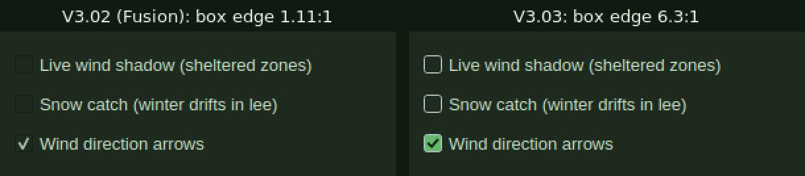
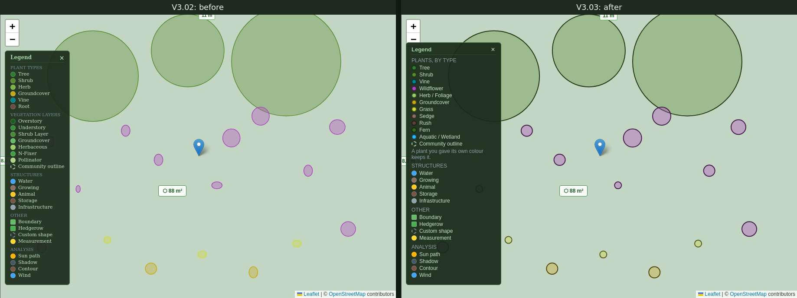

# V3.03 — What can be seen

*The second half of **F195**, step 5 of the V2.98 review of perusing, selecting
and placing plants and communities: "An accessibility baseline". V3.02 did what
a keyboard and a screen reader can do. This is what can be seen: text size,
contrast, target size, the map's colours and its legend. The owner asked for it
with "Continue".*

## What was wrong

Measured on V3.02 (cb1dc8a), the example design open at 1366 × 768 under Xvfb.
Sizes and colours were read from every visible widget on every side tab; the
ground under each piece of text was read from a grab of the whole window, so it
is what is actually on screen, not what a stylesheet says should be.

**Text.** The app's base text is 13 px, and most tabs use it. Two do not:
Plant Communities draws 19 of its 21 pieces of text under 12 px, and Field Notes
21 of 23, almost all at 11 px. Elsewhere one to six captions per tab sit at 9–11
px. In the panels' source, 164 font sizes are below 12 px (125 at 11, 34 at 10,
four at 9, one at 8) across 22 files, and the map's page and scripts hold 26 more
(its tooltips, labels and legend). The plant rows' badges use the application
font one point down, about 11 px on Windows; the builder's canvas labels are
8 pt and the species page's season bar 10 px.

**Contrast**, text that is enabled and below WCAG's 4.5:1:

| What | Colours | Contrast |
|---|---|---|
| The muted grey for hints and counts ("Drag or right-click plants here…", "61 communities", "19 plants placed", "First import in a new area…") | `#78909c` on `#1e2a1e` | 4.46:1 |
| The month strip in Analysis → This Month; "Data confidence" in Bees | `#5f7d8c`, `#607d8b` | 3.42:1 |
| The "no value yet" dashes in Site Info and Slope; "0 words" in Notes | `#546e7a` | 2.77:1 |
| Show sun path, Show Human Forage | `#fff3e0` on `#e65100` | 3.46:1 |
| Calculate Establishment Water Budget | `#e1f5fe` on `#0277bd` | 4.27:1 |
| A plant row's "–" (not native) badge | `#90a4ae` on `#37474f` | 3.65:1 |
| Learn's progress dots, a graphic (3:1 applies) | `#3a5a44` | 1.94:1 |

The native "AB" badge is 4.54:1, a pass by a hair at about 11 px. Disabled
buttons (Plant Communities' Edit, Delete, Duplicate, + Variation and Export
before a community is chosen; Structures' Place on Map) are 2.4:1, and WCAG
exempts them.

**Targets.** WCAG 2.5.8 asks 24 × 24 px. Every tab has controls under it, one to
fifteen of them: checkboxes 18–20 px tall, spin boxes 20, dropdowns 20–23, Plant
Communities' row of buttons 23 and "▸ Show variations" 16, the search boxes 23,
sliders 15. The scroll bars are 10 px wide.

**The map.** Every plant marker is outlined in its own fill colour, and the fill
is a pale tint. Against the yard (`#c3d5c3` on screen) a grass marker's edge
measures 1.00:1, groundcover 1.50:1, wildflower 1.94:1, shrub 2.14:1. A community
is worse: its small members sit on its tree's canopy disc and measure 1.03 to
1.81:1. WCAG 1.4.11 asks 3:1 of a graphic you need to read the content.

There are **two colour schemes**: single plants by type (twelve colours), and
community members by vegetation layer (seven greens, several of them nearly the
same). The layer colours last only until the design is saved and opened again:
the loader draws every plant by its type (`persistence.py`), so the same design
looks different after a reopen. The community builder had a **third**, five
greens of its own, so a wildflower was a shrub's green in the builder and purple
on the map.

**The legend** lists six of the twelve types, with no purple, the wildflowers,
which are 11 of the example's 19 plants, nor grass, sedge, rush, fern or aquatic.
Its Herb swatch is not the map's herb colour. It has a "Vegetation layers"
section describing colours only a freshly placed community ever shows, ending in
a "Community outline" that nothing on the map draws: the dashed light-green ring
it stands for is each plant's mature spread, shown by the **🌳 Canopy** view. It
is set in the browser's default serif at 10–11 px, and its close control is a
13 px ×.

## The change

### No text under 12 px

Every font size below 12 px becomes 12, in the panels, the dialogs, the plant
rows and the map. 12 px is Windows' smallest UI text (9 pt); the app's body text
stays 13. Where text sat in a box sized for it, the box grew: the native badge
from 18 × 14 to 22 × 16, the season bar's rows from 12 to 16 px, the leaf tabs'
padding by a pixel. A guard test reads the source and fails on any font size
under 12 px, and a smoke test reads the real window and fails on any visible text
under 12 px, inline rich text included.

The cost is height, and in two places width. The panels scroll since V2.98, so
the height costs nothing but scrolling. The width is measured too, because a
panel that scrolls sideways hides the end of every line:

- **Plant Communities' buttons** sat in two rows that mixed what they act on:
  New Community, For a creature…, Delete, Duplicate and + Variation, then Edit,
  Export and Import. At 12 px the first row needed 444 px in a 424 px panel. The
  rows are now by what they act on: the library (New Community, For a
  creature…, Import), then the community you have chosen (Edit, Duplicate,
  + Variation, Export, Delete), Delete last.
- **The Bees tab's species dropdown** sized itself to its longest bee's name,
  429 px. It now shrinks with the panel (it shows about 18 characters), and its
  list still shows each name whole.

**And in a wider font.** The first full run passed here, and would have failed
on CI: this container draws in an Arial-metric font (an alias set up for the
V2.98 review, to see what a Windows user sees), and CI's runner in DejaVu Sans,
about 12% wider, which many Linux desktops use too. In DejaVu two more tabs
scrolled sideways:

- **Field Notes' questions** are checkboxes, and a checkbox's words cannot wrap:
  the longest needed 392 px, the tab 424 of 402. Each question's box now carries
  the question as its name (what a screen reader says), and the words stand
  beside it, wrapping, ticking it when clicked.
- **Plant Communities' title** ("Plant Community Library (saved communities)")
  beside the variations toggle needed 470 of 424. It wraps.

Under DejaVu the tightest tab is now Site → Features, 18 px to spare.

### Contrast

One muted text colour, `#90a4ae` (5.5–5.8:1 on the panels' grounds), replaces
the four greys that failed. The orange buttons go to `#bf360c` (5.11:1 with their
text), the blue one to `#01579b` (6.59:1). The not-native badge's text becomes
`#cfd8dc` (6.67:1), and the native badge's ground `#1b5e20` (7.00:1). Learn's
progress dots rise to `#5c8a68` (3.77:1). The leaf tabs (Habitat, Hedgerow,
Shapes) used the failing grey for the unselected tab and the new muted grey for
the selected one; the selected tab is `#cfd8dc` now, so the two still differ.

On the map, the tooltips' grey second line ("Right-click for options",
`#78909c`) sits on a dark tooltip only 85% opaque, so its ground is the yard or a
tile seen through it: 3.65–4.06:1. The line becomes `#b0bec5` and the tooltip 92%
opaque, 6.3–6.6:1 over either.

Disabled controls stay as they are, exempt and meant to recede. A smoke test
reads every enabled piece of text in the real window, tab by tab, and fails
under 4.5:1 (3:1 for text that is only a symbol: a swatch, a progress dot).

### Targets

One rule in one place, the way V3.02 did the focus ring (`src/target_size.py`,
installed by `main.py` and by the window): a button, checkbox, radio button,
dropdown, spin box, line edit or slider that would draw under 24 px high is given
a minimum of 24, and a button one of 24 wide (a checkbox or radio button only
when it has no words of its own, since its words are part of what you click). A
control fixed smaller has its maximum raised to match. A control's own parts
(the line edit inside a dropdown, a tab bar's scroll arrows) share their owner's
target and are not counted.

**The rule only ever raises.** The first build set 24 on every control, and the
View toolbar showed why that is wrong: a minimum set on a widget *replaces* the
one Qt works out from its text, so the toolbar, which had moved what did not fit
into its » menu, squeezed its buttons to 24 px instead and read "S…ite", "B…ary",
"Mea…ement". So the minimum is set only where both the control's own and Qt's are
under 24, and it is given back each time the control is shown once Qt's reaches
24: Browse's Place button is made empty and named later, and would otherwise keep
a floor its words have outgrown. A test builds a toolbar and fails against the
first rule.

The scroll bars widen from 10 to 14 px, with a handle at least 24 px long, and
the handle can be seen: `#2e4a2e` on its groove was 1.54:1, `#5a8a5a` is 3.75:1.
The map legend's close control is a button, 24 px, with a name a screen reader
says ("Close the legend"), and the Legend toggle 24 px high. A smoke test fails
on any visible control under 24 px.

### A box you can see

Found while looking at Field Notes on the finished build: **an unticked
checkbox's box was invisible**. Under Fusion, the style Linux and CI draw in, Qt
outlines the box in the widget's window colour darkened by 40%, and on these
panels the window colour is the panel: the edge measured 1.11:1, so nothing said
there was a box until it was ticked. Twenty boxes on the real window, ticked or
not, were under WCAG 1.4.11's 3:1 for what identifies a control. The filter
lists, which draw their own boxes because Qt's "paints nothing the eye can find
on a dark ground" (V3.01), had chosen `#4a6a4a`, 2.3:1.

One rule again (`src/indicator_style.py`): the application's style is wrapped in
one that draws a checkbox's box and a radio button's ring itself, the same on
every platform, with everything else left to the platform's own style. A light
edge (`#b0bec5`, 6.3:1 on the panels), empty when off; when on, a green fill
(`#66bb6a`, 7:1) with a dark tick, or a green dot. On a light ground, which a few
system dialogs keep, the edge is dark instead. The filter lists' box takes the
same edge.

*Drawn offscreen with the Wind tab's labels on the panels' colours, once with
Fusion alone and once with `indicator_style`; the 1.11:1 is the real window's.*

### One colour scheme on the map, and a legend that says it

Plants are coloured by **type** everywhere: single plants and community members
alike, which is also what a reopened design already showed, and in the community
builder, which now reads the same table (`src/member_colors.py`, now holding
that one table; the module keeps its name so its importers do not churn). The
layer tables are deleted.

That costs something, and it should be said: **nothing on the map outlines a
placed community**, and nothing did. Its members share an id the move tool
reads, and what grouped a freshly placed one was its layer colours, until the
design was reopened. A community now reads as a cluster of plants, as a reopened
one always did. Drawing it as one thing (an outline in its own line, its name on
hover) is a feature, not a colour, so it is opened as **F202** for the owner.

Each marker is **outlined in its type's colour darkened by 60%**, two pixels
wide: the worst type, grass, then measures 4.92:1 on the yard and the worst
under a tree's canopy, grass again, 3.35:1. The fill keeps the type's tint, so
the colour still says the type. The builder draws on a near-black ground, where a
darker edge would vanish (rush brown's would be 1.4:1), so there the edge is the
type's colour lightened instead, 3.9:1 at worst.

The **legend's plant section is built from the colour table the markers use**
(`html/map/10-plant-key.js`), so it cannot drift again: the eleven types a plant
can have, in the Type filter's words and order, each swatch drawn like a marker,
then the dashed ring named for what draws it ("Mature spread, with Canopy on"),
and a line for plants given their own colour. (The table's twelfth entry, root,
is a legacy value no plant carries.) Sans-serif, 12 px and up, and it scrolls
when the map is short.

### Found on the way: a plant is drawn round

Measuring the community's rings gave one violet member 1.82:1 where its colours
compute to 6:1, and the reason was its shape: it was an ellipse, and the sample
missed the ring. Leaflet 1.9 works a circle's width out with an `acos` that loses
its precision below about a metre. At the example's zoom one 0.1 m plant was
drawn 4.75 px wide and 8.42 tall and the next 8.23 wide, and two 0.15 m plants
9.5 and 11.6 wide, both 12.6 tall: a meadow of ellipses leaning both ways, up to
44% off. The height is a plain difference of two projected points and is right,
and Web Mercator is conformal, so at a yard's scale the width is the height.
`roundCircles` in `10-plant-key.js` sets it so, for every circle on the map, so
the footprint under the cursor (F191) and the selection rings match the markers
they stand for.

It mattered for clicks as well as looks: Leaflet's click test reads the width
alone, so the top and bottom of a drawn plant were not part of it. The example's
Purple Prairie Clover is drawn 8.4 px tall; a right-click 7.5 px above its centre
now opens its menu (Find a substitute…, Remove this plant), where the click
test's edge had been 5.5 px out.

A test loads the vendored Leaflet in node and projects small circles around the
example yard: without the fix they are up to 44% out of round, with it they are
round, and their size is the height they always had.

## Left alone, on purpose

- **A text-size setting.** Qt draws in logical pixels, so the operating system's
  display scaling (Windows' 125–200%, macOS's scaled resolutions) already
  enlarges everything, layout included. A second, app-only setting would need
  every one of the 29 files' stylesheets to read it.
- **Disabled controls' contrast**, exempt under WCAG and meant to recede.
- **The edges of text fields and buttons.** 64 stylesheets outline them in
  `#2e4a2e`, 1.52:1 on the panels, and a field's fill is 1.01:1 against the
  panel, so a field is found by its placeholder or what is in it. Raising them
  to 3:1 changes the look of every panel, which is the owner's call rather than
  a floor's, and a field, unlike a checkbox, says what it is in words. Measured
  and opened as **F203**.
- **The vegetation layer as a colour.** A community's layers are still in its
  data, its builder (Auto-arrange by layer, the Members list) and the generator;
  only the map's colouring by them is gone, because it could not survive a
  reopen and the legend could not honestly say it.
- **The satellite basemap.** The outline rule is measured on the drawn map; over
  dark imagery a darker outline helps less. Not checked: see the last section.
- **The public website** (`html/site/`), which has its own type scale and is not
  part of the desktop app. Nor the PDF export, which is print, sized in points.
- **A test-order leak found on the way.** `tests/test_species_page.py` leaves
  about fifty windows open, and run before `tests/test_filter_widgets.py` in one
  process it makes the Down-key test there fail. It fails the same on V3.02, and
  the suite's own order (alphabetical) never runs them that way. Proposed as its
  own task rather than widened into this one.

## How it is checked

- `tests/test_visual_floor.py` (new, 13): no font size under 12 px anywhere in the
  desktop app's source (the panels, the dialogs, the map's page and scripts; not
  the PDF export or the website), and no `setPixelSize` under 12 or
  `setPointSize` under 9; the small controls measured on V3.02 reach 24; a button
  fixed at 16 × 16 is raised; a vertical slider is made wide enough; a minimum is
  given back when its text outgrows it; a toolbar still overflows rather than
  squeezing (fails against the first rule); a control's own parts are not
  counted; a checkbox with no words is made 24 wide (the first rule left it at
  14); every checkbox and radio state's edge clears 3:1 on the panel, and Fusion
  alone did not; Field Notes' boxes are named by their questions, whose words
  wrap and tick them. **A trap for any test that reads pixels**: once an
  earlier test has pressed a key, V3.02's focus ring rings whatever gains focus,
  so the first full run measured the ring's yellow over a box's edge (11.6:1)
  and failed a test that passed alone. The drawn controls take no focus now.
- `tests/test_plant_key.py` (new, 18): the map's colour table and type words are
  the Python ones; every type's outline clears 3:1 on the yard and under a tree's
  canopy, and the old outline did not; one style for every marker; the legend
  lists every type in its colour, names the dashed ring for what draws it and not
  "Community outline", and the page loads the script last with a button to close
  the legend; no other map script reads the colour table; the builder's edges
  clear 3:1 on its ground; the layer tables are gone; and every circle is round
  under the vendored Leaflet, which alone draws ellipses.
- `tests/test_app_smoke.py`, six new on the real window, every side tab and
  sub-tab in turn at 1366 × 768: no visible text under 12 px; enabled text clears
  4.5:1 (symbols 3:1) against the ground read from a grab; every checkbox's box
  clears 3:1; every control is 24 px; no tab scrolls sideways; community members
  are drawn in the colour a reload draws them. Run in both fonts: this
  container's Arial-metric alias and DejaVu Sans, CI's.
- **Red**, each new test against what it replaced: the first five smoke tests
  run against V3.02's source fail (5 failures, 0 errors); the checkbox one,
  with the style taken out, names 20 boxes (Site → Slope's "Show contour lines"
  at 1.11:1 the first); the overflow one, in DejaVu before the wrapping, names
  Field Notes and Plant Communities; the toolbar test fails against the first
  target rule; the round-circle test fails on all 12 of its cases with the fix
  taken out.
- **Live**, under Xvfb at 1366 × 768 on the example design: the walks in
  *Results*.

## Results

Live, on the example design at 1366 × 768:

| | V3.02 | V3.03 |
|---|---|---|
| Text under 12 px, all 24 side tabs | 19 of 21 in Plant Communities, 21 of 23 in Field Notes, 1–6 elsewhere | 0 of 826 |
| Font sizes under 12 px in the source | 190 (164 panels, 26 map) | 0 |
| Enabled text under 4.5:1 | the seven in *What was wrong* | 0; the two symbols left under it are graphics over 3:1 (the sun legend's squares 3.07, Learn's dots 3.77) |
| Controls under 24 px | 1 to 15 on every tab | 0 |
| Tabs that scroll sideways, Arial metrics | 0 | 0 (the 12 px floor made two, regrouped before it shipped) |
| Tabs that scroll sideways, DejaVu Sans (CI) | not measured | 0 (the second build had two, now wrapping) |
| Checkbox and radio boxes under 3:1, real window | 20 (unticked edge 1.11:1) | 0 (edge 6.3:1) |
| A marker's outline on the yard, worst type | 1.00:1 (grass, on screen) | 4.92:1 (grass, computed) |
| Community members' rings on their canopy, on screen | 1.03–1.81:1 | 4.50–6.74:1 (Parkland Woodland Wildflowers' six) |
| Colour schemes for plants | three (type, layer until reopened, the builder's own) | one |
| Plant types in the legend | 6 of 11, no wildflower | 11 of 11 |
| Legend entries for something the map does not draw | 1 ("Community outline") | 0 |
| Small markers out of round | widths 0.56–1.38 of their height | 0 px over all 19 of the example's |

The before and after of the map, on the same view:

**The suite**, in this container, as CI runs it and in CI's font (DejaVu Sans):
4,316 tests (V3.02: 4,279), 0 failed, 19 skipped (bpy 7, rasterio 5, pypdf 3,
and one each for the PyQt6 import order, the nDSM backend, running as root and
the shallow clone), `RESULT: OK`. An earlier full run in the Arial-metric font,
before the wrapping and the boxes, was 4,310 and OK, which is how the font
difference was nearly missed. `validate-data`: clean, its 113 warnings the
existing data debt.

## What could not be verified here

- **The satellite basemap.** Its tiles do not load in this container (no
  imagery reaches it), so the dark outlines were never seen over photographs,
  where a darker edge helps less than over the drawn map.
- **The operating system's display scaling at 125–200%**, which is how a person
  who needs bigger text gets it. Qt scales layout and text together and the
  24 px floor is in logical pixels, so it scales with them; but no scaled screen
  was looked at.
- **Windows' and macOS's own fonts and styles.** Text was measured at 96 dpi in
  two fonts, an Arial-metric one and DejaVu Sans, about 12% wider and one of the
  widest common UI fonts; Segoe UI and San Francisco are narrower than DejaVu,
  so a tab that fits it should fit them, but neither was seen. The checkbox
  boxes were measured under Fusion; on Windows and macOS the same drawing
  replaces the platform's own box, and was not seen there.
- **High-contrast modes** (Windows' contrast themes, macOS's Increase Contrast),
  which the app's own stylesheets override today.
- **`tests/test_undo_redo.py`**, which segfaults in its own teardown wherever
  there is no GPU, this container and CI alike (see CLAUDE.md). Nothing here
  changes undo; it needs a real desktop.
