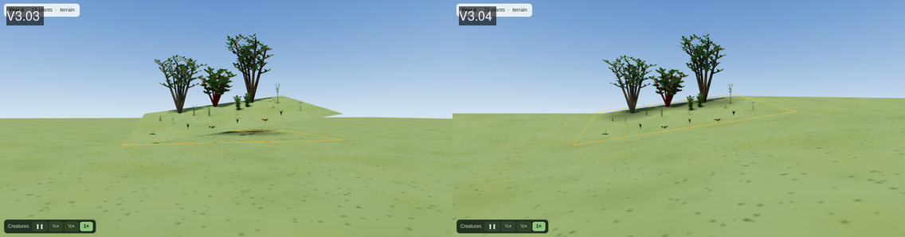

# V3.04 — The start screen, the filter lists, and the 3D view on a slope

*Three fixes in one increment. **F197**, the start-screen race the V2.98 review
found, which the owner picked as "that easy fix". And two things the owner hit
and reported with it: "when clicking a filter … 1 click opens the selection drop
down. I need a second click of the filter category to close the list", and "3d
issues with slope", with two screenshots of the 3D preview of a sloped yard.*

## What was wrong

### The start screen dropped what you chose (F197)

Continue, Open a design, See a finished design and Recover all draw a project, so
`onboarding_flow.act_on_start_choice` held them until the map said `map_ready`.
That signal fires once per page load. The window is built behind the start screen
(main.py, on a zero-timer inside the screen's modal loop), so the map has
usually loaded long before anyone clicks, and the choice then waited for a
signal that had already gone. The V2.98 review traced it: map ready at 1.92 s,
Continue clicked at 25.87 s, design never loaded; a click at 1.88 s worked. You
landed on an empty map with no error.

### A filter list needed a second click to close

The filter dropdowns (Type, Sun, Water, Role, Restoring toward …) are
multi-select lists drawn as ordinary dropdowns. Every click on a row ticked or
unticked it and left the list open for more, so closing it took a click outside
the list, which Qt's popup consumes: the "second click of the filter category"
in the report. An ordinary dropdown closes when you choose, and these look like
one. V3.01 had added a line at the top of each list saying "Tick as many as you
like", which said the list stays open but not how to leave it.

Found on the way: in the one list with branches (Restoring toward …), a click
in a branch row's first 18 px opened or closed the branch, and that is where the
row's box is drawn, so a branch could not be ticked by its box.

### The 3D preview on a slope

The screenshots: from near the ground, the yard was a raised patch with a white
band under its front edge, a strip of ground hanging above the band, and the
trees' shadows lying on the flat ground in front of the trees rather than under
them.

Every plant stands on `terrainHeightAt` (html/scene3d/02-plants.js), which
follows the slope and, since V2.38, holds the grid's edge heights outside it.
Nothing that *lies* on the ground asked it:

- **The ground** was two meshes: the terrain, a patch exactly the size of the
  boundary's bounding box (all the elevation fetch covers), and under it a flat
  apron at the site's lowest point, three times the scene's bounds. On a slope the
  patch's edges stood their full relief above the apron, so seen from the side
  the sky showed through the gap: the white band. The patch is drawn one-sided,
  so from below its edge it disappears, and the apron and everything lying on
  it show through. A plant outside the boundary stood at the edge's height, on
  nothing. The apron itself ended 75 m out on a small design, and past it was
  sky again.
- **The contact shadows** (the soft discs under trees and tall shrubs) sat at a
  fixed 3 cm: on the apron, under a hill they belonged on top of. That is the
  likeliest reading of the shadows in the screenshots: discs on the flat ground,
  seen through the underside of the patch.
- **The boundary line** was drawn at a fixed 12 cm, **buildings** and the
  **fallback structure boxes** stood on 0, and the **planting animation** played
  at 0.
- **A click in the 3D view** (Plant, Remove) hit a flat plane at 0, which on a
  slope lies under nearly all of the yard. The plant goes in where that plane
  was hit, beyond the spot under the cursor.
- **The orbit camera** turned about a pivot at 0, and `maxPolarAngle` only keeps
  it above the plane through the pivot, so an orbit turned low went into the
  hill on the uphill side, where the one-sided ground vanishes.

Measured with the probe below on V3.03's code, a 20 m grid with 6 m of relief:

| What | V3.03 |
|---|---|
| Ground under a tree outside the grid, vs where the tree stands | 6.00 m below it |
| Ground at 1.4 km in eight directions | none (the apron ended at 75 m) |
| Contact shadows, height off the ground | up to 6.00 m |
| Contact shadows, tilt against the slope | 12.6° off (cos 0.976) |
| Boundary line, off the ground | 5.7 m at a corner, 4.8 m mid-edge (5 vertices for 72 m) |
| A building's base / top, ground under it 3.0–4.2 m | 0 / 3.0 m (buried) |
| A fallback structure box's foot, ground 4.5 m | 0 |
| The planting animation, ground 3.9 m | at 0 |
| A click, metres from the ground point under the cursor | 19–1,003 m, and 2 of 6 points no hit at all |
| The orbit pivot, ground under it 3.0 m | 0 |
| The camera, orbited low on the uphill side, ground 5.8 m | 3.6 m (inside the hill) |

The probe's camera is low on purpose, which makes its click errors extreme. At
the 3D window's own opening view, 31° down, on the example yard with a 3 m
rise pushed under it: a click on the uphill corner landed **4.94 m** beyond the
cursor, one at the centre **2.51 m**, one on the low corner 0.27 m.

## The change

### F197: a choice made after the map has loaded is carried out

`MapWidget.is_ready` is true once the page has said it is ready and false again
whenever a load starts. `act_on_start_choice` runs the choice at once when the
map is ready (on a zero-timer, so after main.py has shown the window, as the
signal path did) and waits for `map_ready` only when it is not.

**That alone opened the design as a dot.** Checked live before committing:
Continue, clicked with the map loaded, opened the example at zoom 18.4, where
opening it into the laid-out window frames it at 22.8. The map page is hidden
behind the start screen, 0 × 0, and still Qt's 100 × 30 default for a moment
after the window shows, and Leaflet frames a design to the size the map has.
The old path never met this, because the only choices it carried out were made
before the map loaded, and those loaded after the window was shown.
`fitWhenShown` (html/map/02-boundary.js), which opening a design now fits
through, fits as well as it can and, when the map is hidden or under
200 × 150, fits again once when the map is first given a real size. A fit made
on a visible map is left alone, so resizing the window later never throws the
view back to the design. Continue now opens at 22.9, the same as reopening the
design into the laid-out window.

**And the first build of the check raised on a window already gone.** The full
suite caught it (`test_sun_shade`'s guard that a start choice on a deleted window
is a no-op): `getattr`'s default covers a missing attribute, not the
`RuntimeError` a deleted widget raises. `_map_is_ready` asks `is_alive` first.

### A filter list closes when you choose a name

A click on a row means what it lands on:

- **the name**: tick it and close the list, as any dropdown does;
- **the box**: tick it and keep the list open, to choose several;
- **a branch's ▾** (Restoring toward …): open or close the branch.

The line each list opens on says how to choose several: "Tick boxes to choose
several. A plant needs one." (Role: "every one"). The keyboard is unchanged.

### The 3D ground follows the slope

- **One ground, which is `terrainHeightAt` everywhere.** Its vertices are the
  grid's own inside the grid and the grid's edges carried outward by the same
  clamp beyond it, so the ground and what stands on it cannot disagree. It
  reaches 1,500 m, where the fog (01-core.js) is opaque, so no edge of it shows.
  It sits 2 cm under the height things stand on, as the apron did, so nothing
  lying on it flickers. Its texture is laid in metres, so there is no seam where
  the patch used to meet the apron.
- **Contact shadows lie on the ground**, 3 cm up and tilted to the slope there
  (`onGround`).
- **The boundary is draped**: each edge cut into 1 m steps, each 12 cm above the
  ground under it.
- **A building stands on the lowest ground under its outline** and keeps its
  height above the highest, so no side hangs in the air and none is buried.
  Fallback structure boxes and the planting animation stand on the ground.
- **A click meets the ground.** `groundPointAt` walks the ray from the camera
  against `terrainHeightAt` and refines the crossing by halving, between the
  planes through the highest and lowest ground. The flat plane is still the
  answer when there is no terrain. The ghost marker sits on the ground it found.
- **The orbit stays out of the hill.** The pivot is put on the ground when the
  camera is framed, and moved onto it, carrying the camera, when the terrain
  arrives after the first scene (it is fetched on a thread and usually does).
  The render loop keeps the camera at least 0.5 m above the ground under it.

**For a flat design** the one visible change is that the ground now reaches the
horizon instead of ending in a square 75 m out.

## Left alone, on purpose

- **Past the boundary the ground is the boundary's edge, held.** The elevation
  grid covers the boundary's bounding box and nothing else
  (`zoning.site_elevation_grid`), and holding the last known height is what
  `terrainHeightAt` has done since V2.38 (P9: no data out there, so invent
  none). On a real hillside the hill goes on rising past the fence and the view
  shows a terrace instead. Fetching the scene's whole extent changes the cache
  key and the grid limit and is shared with the generator: opened as **F204**.
- **The ground is drawn in triangles and `terrainHeightAt` is bilinear.** They
  differ inside a grid cell by up to a quarter of its twist,
  |h00 + h11 − h01 − h10| / 4, which on the 10 m DEM grid is centimetres on a
  yard. As before; the test grid is planar, where they agree exactly.
- **Only the contact shadows tilt.** Groundcover mats and other wide, flat
  bodies stand level at their centre's height. Not seen at the slopes tried here
  and not measured.
- **Moving from one open filter list to another still takes two clicks.** Qt's
  popup consumes the click that closes it, as dropdowns on every platform do.
- **The 3D window keeps the terrain it fetched while it is open**; a boundary
  redrawn meanwhile shows on reopening. As before.

## How it is checked

- `tests/test_start_menu.py` `TestAChoiceAfterTheMapHasLoaded`: Continue, Open,
  See a finished design and Recover chosen after the map loaded are carried
  out; one chosen before it still waits and runs once.
  `tests/test_app_smoke.py` `test_the_map_says_whether_it_has_loaded`.
- `tests/test_fit_when_shown.py`: the real `02-boundary.js` in node against a
  stubbed map, as `test_map_keyboard` does: a fit made hidden is made again at
  the first real size and only then; one made on a visible map is never redone;
  opening a design fits through it.
- `tests/test_filter_widgets.py` `TestWhatAClickOnARowMeans`: a name chooses and
  closes, a box ticks and stays open, a branch's arrow opens it and ticks
  nothing, a branch's box ticks it.
- **`tests/test_slope_render.py`**, with `html/slope_probe.html`: the real viewer
  in headless Chromium (the harness `test_scene3d_render.py` uses), a slope with
  6 m of relief, a tree past the grid, a boundary, a building, a box structure.
  Ten checks ask each thing above whether it agrees with `terrainHeightAt`, and
  five source guards cover a machine with no browser. **Run against V3.03** (a
  worktree at `ee032a5` with the probe copied in) all fifteen fail, the ten
  render checks with the numbers in the table above. Headless Chromium stops drawing frames a
  few seconds in, so the camera check calls what the render loop calls, and a
  source guard checks the loop calls it; the loop itself was watched doing it
  live.
- **Live**, under Xvfb at 1366 × 768, the example design: the start screen's
  "See a finished design" and, on the final build, Continue, each clicked with
  the map already loaded (the design opened, 19 plants, framed at zoom 22.9);
  a Type list closed on a name ("Type: Shrub") and stayed open on a box; and
  the 3D window with a 3 m slope pushed under the example, looked at from eye
  level before and after, the camera put inside the hill (lifted to 0.5 m
  above ground), and clicks at five points on the slope (0 m off).

## Results

| What | V3.03 | V3.04 |
|---|---|---|
| Ground vs where things stand, 321 points from −60 to 60 m | 6.00 m off | 0.000 m |
| Ground at 1.4 km, eight directions | 0 of 8 | 8 of 8 |
| Contact shadows: height / tilt | 6.00 m / cos 0.976 | 0.000 m / 1.000 |
| Boundary off the ground: vertex / mid-edge | 5.7 / 4.8 m | 0.000 / 0.000 m (73 vertices) |
| Building base / top over ground 3.0–4.2 m | 0 / 3.0 m | 3.0 / 7.2 m |
| Box structure's foot, ground 4.5 m | 0 | 4.5 m |
| Planting animation, ground 3.9 m | 0 | 3.9 m |
| Click error, probe view | 19–1,003 m, 2 missed | 0.000 m, 0 missed |
| Click error, opening view, uphill corner / centre | 4.94 / 2.51 m | 0 / 0 m |
| Orbit pivot, ground 3.0 m | 0 | 3.0 m |
| Camera low on the uphill side, ground 5.8 m | 3.6 m | 6.3 m |

**The suite**, in this container, as CI runs it and in CI's font (DejaVu Sans):
4,345 tests (V3.03: 4,316), 0 failed, 19 skipped (bpy 7, rasterio 5, pypdf 3,
and one each for the PyQt6 import order, the nDSM backend, running as root and
the shallow clone), `RESULT: OK`. The first full run had one error, the
deleted-window case above. `validate-data`: clean, its 113 warnings the
existing data debt.

**CI**: on `16a2c87`, Tests (run 33) ran 4,345 tests, 0 failed, 16 skipped, `RESULT: OK`,
with the usual CI skip reasons (bpy 7, Pillow 3, pypdf 3, and one each for the PyQt6
import order, the nDSM backend and the shallow clone); the Windows installer (run 380) and
the macOS DMG (run 388) both green, and `release-V3.04` is published with both for the
in-app updater. Recorded on V3.05's branch, so that a docs-only push to V3.04 would not
re-run its release builds.

## What could not be verified here

- **The owner's own site.** The terrain here is a synthetic slope pushed into the
  3D window: this container cannot reach the elevation service, so no real DEM
  was drawn. A real grid is the same shape of data (rows of heights over the
  boundary's box) and goes through the same code, but its roughness was not seen.
- **Frames in a browser.** Headless Chromium stops drawing a few seconds in, so
  the render loop's part was watched live under Xvfb, not in the test.
- **A real GPU.** Everything 3D here ran on SwiftShader.
- **`tests/test_undo_redo.py`**, which segfaults in its own teardown wherever there
  is no GPU (see CLAUDE.md). Nothing here changes undo.
